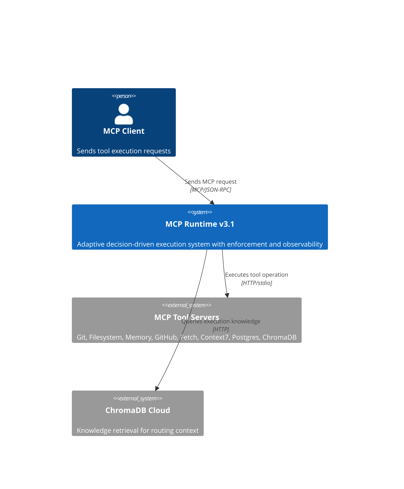
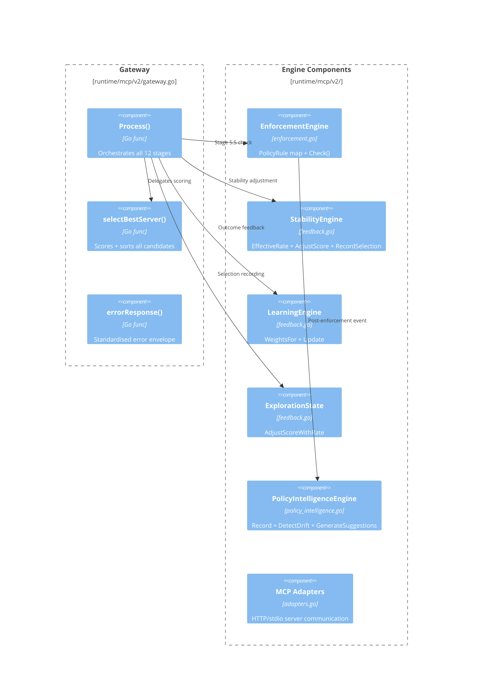
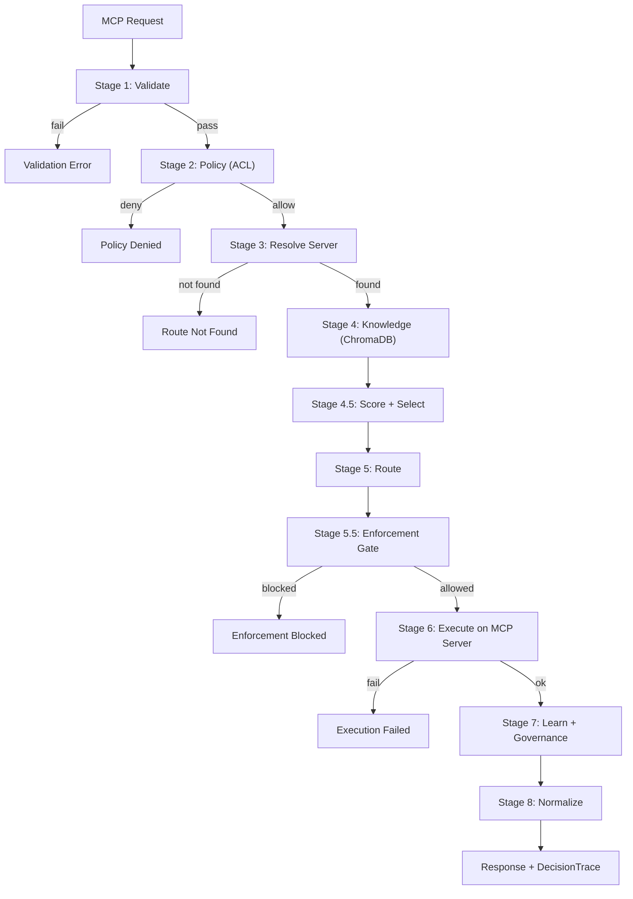

# MCP Runtime — C4 Architecture Model

**Version:** v3.1.0-stable  
**Model:** C4 (Context → Container → Component → Execution Flow + Data Contracts + Boundaries)

---

## Section 1: System Boundary Map

```
┌─────────────────────────────────────────────────┐
│                 EXTERNAL WORLD                   │
│  ┌──────────┐     ┌──────────────────────┐       │
│  │   MCP    │     │   MCP Tool Servers   │       │
│  │  Client  │     │  (Git, FS, Memory,   │       │
│  │ (Public) │     │   GitHub, Fetch,     │       │
│  └────┬─────┘     │   Context7, Postgres,│       │
│       │           │   ChromaDB HTTP)     │       │
│       │ MCP Req   └──────────┬───────────┘       │
│       ▼                      │                    │
│  ┌─────────────────────────────────────────┐      │
│  │         MCP RUNTIME v3.1                │      │
│  │  (Decision + Control + Execution +      │      │
│  │         Observability)                  │      │
│  └──────────────────────┬──────────────────┘      │
│                         │                         │
│                  ┌──────▼──────┐                  │
│                  │  ChromaDB   │                  │
│                  │   Cloud     │                  │
│                  │ (Knowledge) │                  │
│                  └─────────────┘                  │
└─────────────────────────────────────────────────┘
```

### System Boundary Rules

- **Inside MCP Runtime**: All decision logic, enforcement, execution orchestration, observability
- **Outside (controlled)**: MCP Tool Servers (pre-registered), ChromaDB (query-only)
- **Outside (untrusted)**: MCP Client (public, unauthenticated)
- **Rule**: No external system can influence enforcement logic directly

---

## Section 2: C4 Context Diagram



---

## Section 3: C4 Container Diagram


### Container Ownership Map

| Container | File(s) | Plane | Lifecycle |
|-----------|---------|-------|-----------|
| Request Processor | `gateway.go` | Execution | Per-request |
| Router | `gateway.go` | Execution | Per-request |
| Scoring Engine | `feedback.go`, `schema.go` | Intelligence | Per-request + persistent weights |
| Stability Engine | `feedback.go` | Intelligence | Persistent (accumulates state) |
| Learning Engine | `feedback.go` | Intelligence | Per-request (appends) |
| Enforcement Engine | `enforcement.go` | Control | Persistent (rule map) |
| Policy Intelligence | `policy_intelligence.go` | Observability | Persistent (event store) |
| Decision Trace | `schema.go` | Observability | Per-request (attached to response) |
| Governance Audit | `governance.go` | Observability | Per-request (appends to log) |

---

## Section 4: C4 Component Diagram



### Component Responsibilities

| Component | Responsibility | Input | Output |
|-----------|---------------|-------|--------|
| `Process()` | Stage orchestration | `MCPRequest` | `MCPResponse` |
| `selectBestServer()` | Candidate ranking | `[]ServerCandidate` | `ServerCandidate` |
| `EnforcementEngine.Check()` | Gate check | `(server, operation)` | `EnforcementResult` |
| `StabilityEngine.AdjustScore()` | Stability adjustment | `(server, score, operation)` | `adjustedScore` |
| `LearningEngine.Update()` | Weight learning | `(server, operation, success)` | `void` |
| `PolicyIntelligence.Record()` | Event recording | `PolicyEvent` | `void` |

---

## Section 5: Execution Flow



### Data Handoff Per Stage

| Stage | Input | Processing | Output | Owner Plane |
|-------|-------|-----------|--------|-------------|
| 1 | Raw request | Schema validation | `MCPRequest` | Execution |
| 2 | `MCPRequest` | ACL check | `policyResult` | Execution |
| 3 | `MCPRequest` | Server capability match | `[]ServerCandidate` | Execution |
| 4 | `MCPRequest` | ChromaDB query | `KnowledgeContext` | Execution |
| 4.5 | `[]ServerCandidate` | Score + stability + select | `selected Server` | Intelligence |
| 5 | `selected Server` | Route binding | `(server, operation)` | Execution |
| 5.5 | `(server, operation)` | Enforcement rule check | `EnforcementResult` | Control |
| 6 | `(server, operation, args)` | MCP call | `ExecutionResult` | Execution |
| 7 | `ExecutionResult` | Weight update + audit | `void` | Intelligence + Observability |
| 8 | `ExecutionResult` | Response format + trace | `MCPResponse` | Execution |

---

## Section 6: Plane Ownership Map

| Plane | Components | Authority |
|-------|-----------|-----------|
| **Execution** | Gateway, MCP Adapters, Router | Deterministic execution |
| **Intelligence** | Scoring, Stability, Learning, Exploration | Decision influence only |
| **Control** | Enforcement Engine | Allow/Block authority (sole) |
| **Observability** | Decision Trace, Governance Audit, Policy Intelligence | Recording only |
