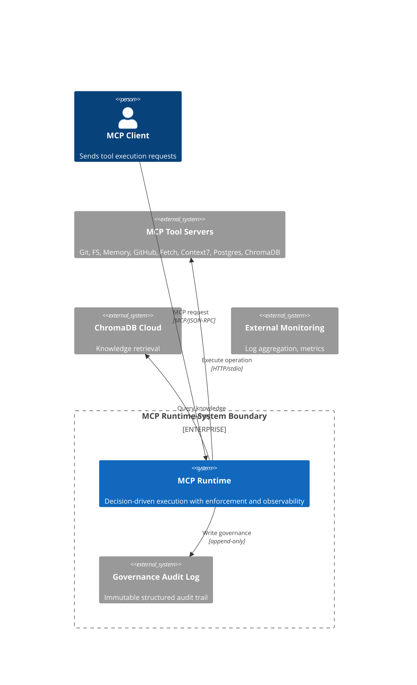
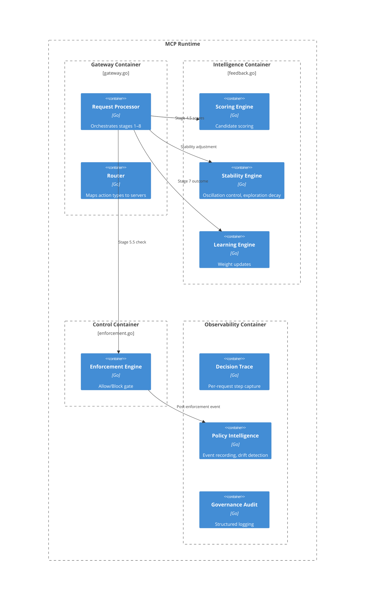
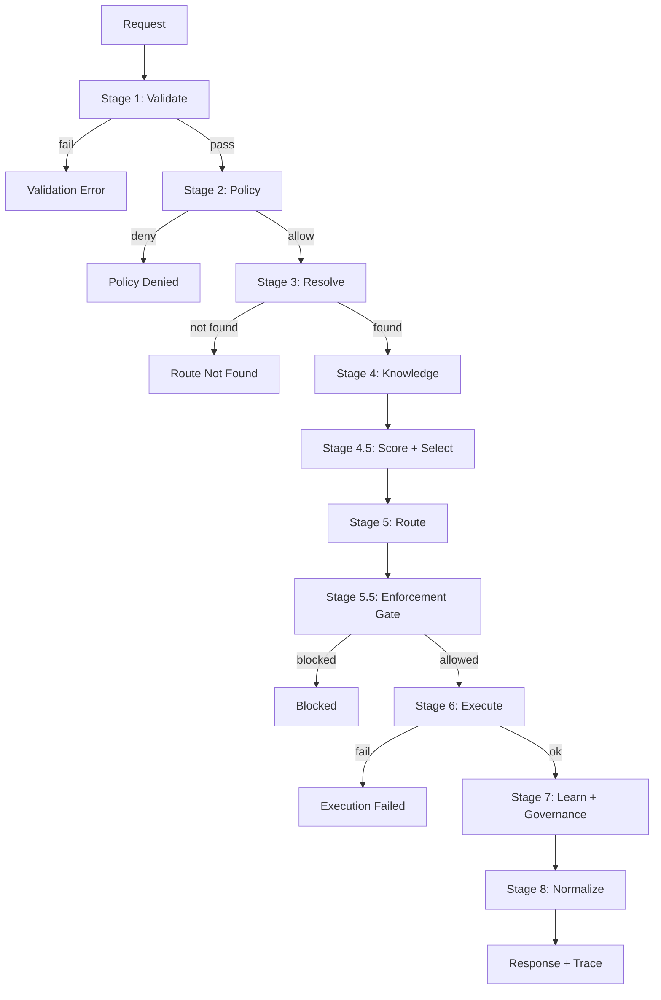
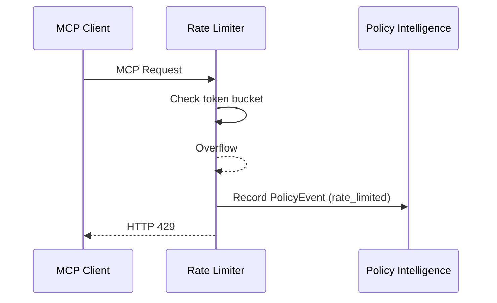
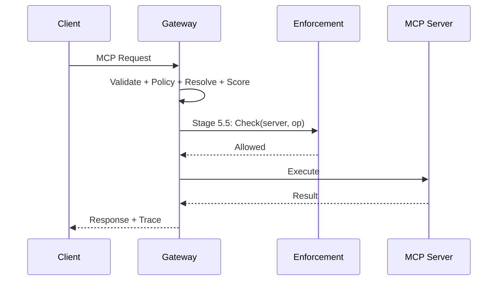
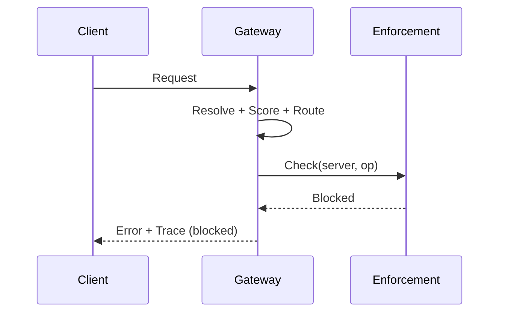

# MCP Runtime — C4 Architecture Model

**Version:** v3.1.1-stable
**Model:** C4 + Sequence Diagrams + Component Deep Specs

---

## 1. System Boundary Map

```
INSIDE MCP RUNTIME:
├── Request Processor       (gateway.go)
├── Router                  (gateway.go)
├── Scoring Engine          (feedback.go)
├── Stability Engine        (feedback.go)
├── Learning Engine         (feedback.go)
├── Enforcement Engine      (enforcement.go)       ← SOLE AUTHORITY
├── Policy Intelligence     (policy_intelligence.go)
├── Governance Audit        (governance.go)
└── Decision Trace          (schema.go)

OUTSIDE (registered): MCP Tool Servers, ChromaDB Cloud
ALWAYS EXTERNAL (untrusted): MCP Client
```

---

## 2. C4 Context Diagram



---

## 3. C4 Container Diagram



---

## 4. C4 Component Diagram

| Component | File | Input | Output | Invariant |
|-----------|------|-------|--------|-----------|
| `Process()` | `gateway.go` | `MCPRequest` | `MCPResponse` | Always produces response |
| `selectBestServer()` | `gateway.go` | `[]ServerCandidate` | `ServerCandidate` | Deterministic scores |
| `EnforcementEngine.Check()` | `enforcement.go` | `(server, op)` | `EnforcementResult` | Sole blocking authority |
| `StabilityEngine.AdjustScore()` | `feedback.go` | `(server, score, op)` | `adjustedScore` | Never blocks execution |
| `LearningEngine.Update()` | `feedback.go` | `(server, op, success)` | `void` | No live effect on request; delta: +0.01/-0.02 (safety-biased) |
| `RateLimiter.Check()` | Edge | `(clientID, op)` | `allow/429` | Pre-gateway only; never enters pipeline |
| `PolicyIntelligence.Record()` | `policy_intelligence.go` | `PolicyEvent` | `void` | Never feeds back |

---

## 5. Execution Flow



---

## 6. Sequence Diagrams

### 6.0 Rate Limit Block


### 6.1 Normal Request



### 6.2 Enforcement Block



---

## 7. Plane Ownership Map

| Plane | Components | Authority |
|-------|-----------|-----------|
| **Execution** | Gateway, Router, Adapters | Deterministic execution |
| **Intelligence** | Scoring, Stability, Learning, Exploration | Decision influence only |
| **Control** | Enforcement Engine | Allow/Block (sole) |
| **Observability** | Decision Trace, Policy Intelligence, Audit | Recording only |

---

## 8. Data Contracts

### EnforcementResult
```
{ Allowed: bool, RuleMatched: string, BlockReason: string }
Invariant: Allowed=false → pipeline terminates; no override possible
```

### PolicyEvent
```
{ TraceID, Server, Operation, decision: "allowed"|"blocked"|"audit"|"rate_limited", RuleMatched, Timestamp }
Invariant: Single mutually exclusive enum — exactly one value per event
```

### TraceStep
```
{ Stage: int, Component: string, Input, Output, Duration, Error }
Invariant: All stages captured; cap at 128 steps
Size: Input/Output ≤ 512 bytes each; total trace ≤ 64 KB
```

---

## 9. System Invariants (with Binding Table)

| # | Invariant | Enforced By |
|---|-----------|-------------|
| I1 | Enforcement is sole control authority | `EnforcementEngine.Check()` |
| I2 | Intelligence cannot influence enforcement | `StabilityEngine`, `ScoringEngine`, `LearningEngine` |
| I3 | Deterministic execution | `selectBestServer()`, `Process()` |
| I4 | System works without intelligence | `Process()` stage orchestration |
| I5 | Traceability always on | `Process()` defer trace population |
| I6 | Policy Intelligence is passive | `PolicyIntelligenceEngine` design constraint |
| I7 | Fail-close on uncertainty | `EnforcementEngine.Check()` timeout handler |
| I8 | Rate Limiter is edge-only | `RateLimiter` Stage 0 placement |
