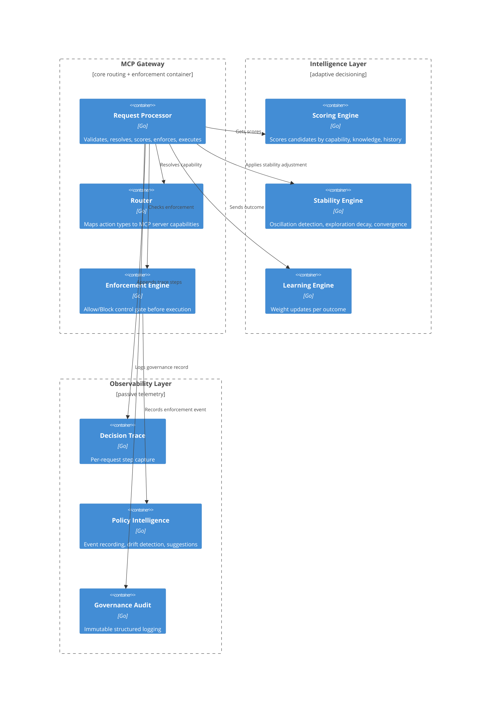
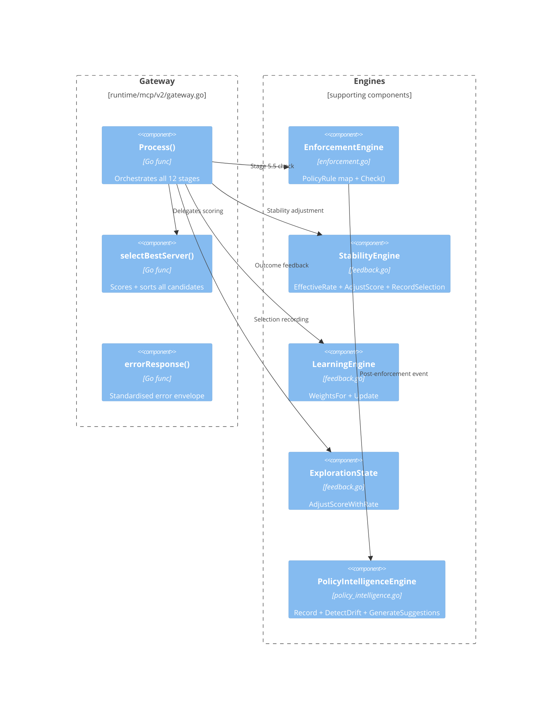
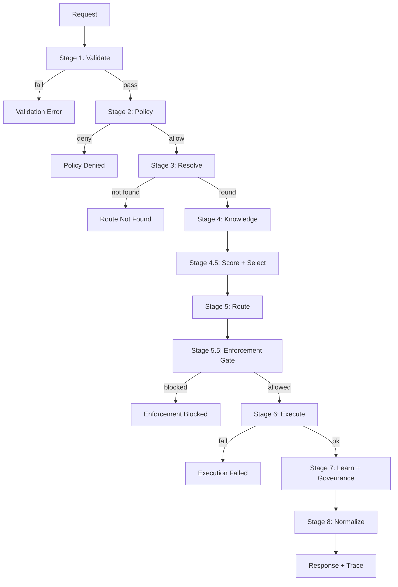

# MCP Runtime — C4 Architecture Model

**Version:** v3.1.0-stable  
**Model:** C4 (Context → Container → Component → Execution Flow)

---

## Level 1: System Context Diagram

---

## Level 2: Container Diagram

---

## Level 3: Component Diagram (Gateway)

---

## Level 4: Execution Flow Diagram

---

## Plane Ownership Map

| Plane | Components | Authority |
|-------|-----------|-----------|
| **Execution** | Gateway, MCP Adapters, Router | Deterministic execution |
| **Intelligence** | Scoring, Stability, Learning, Exploration | Decision influence only |
| **Control** | Enforcement Engine | Allow/Block authority |
| **Observability** | Decision Trace, Governance Audit, Policy Intelligence | Recording only |
