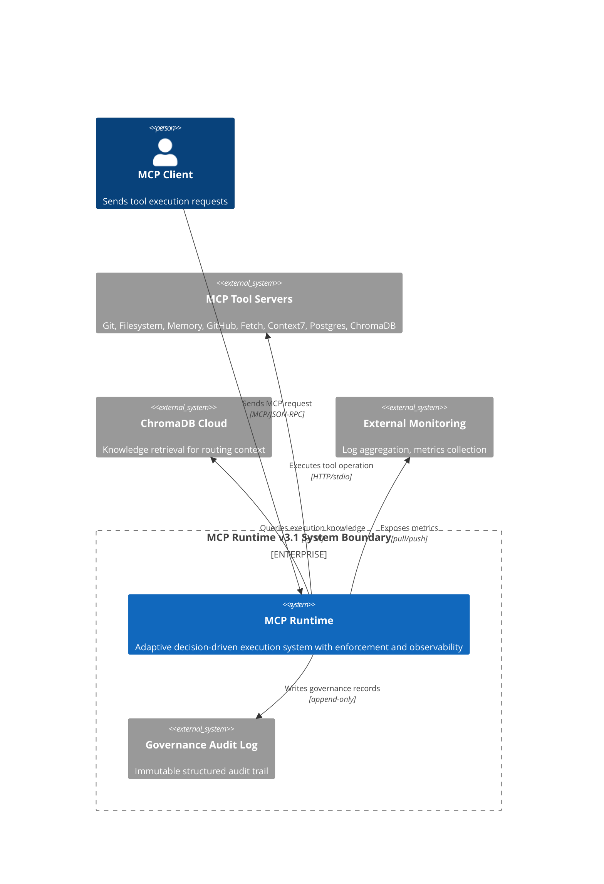
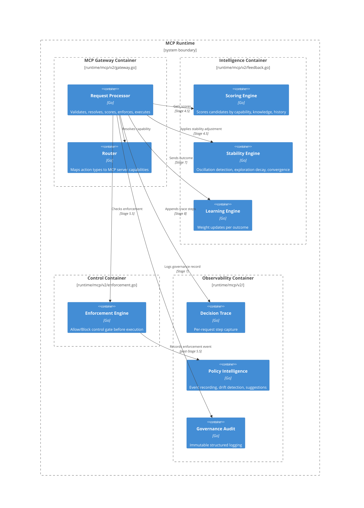
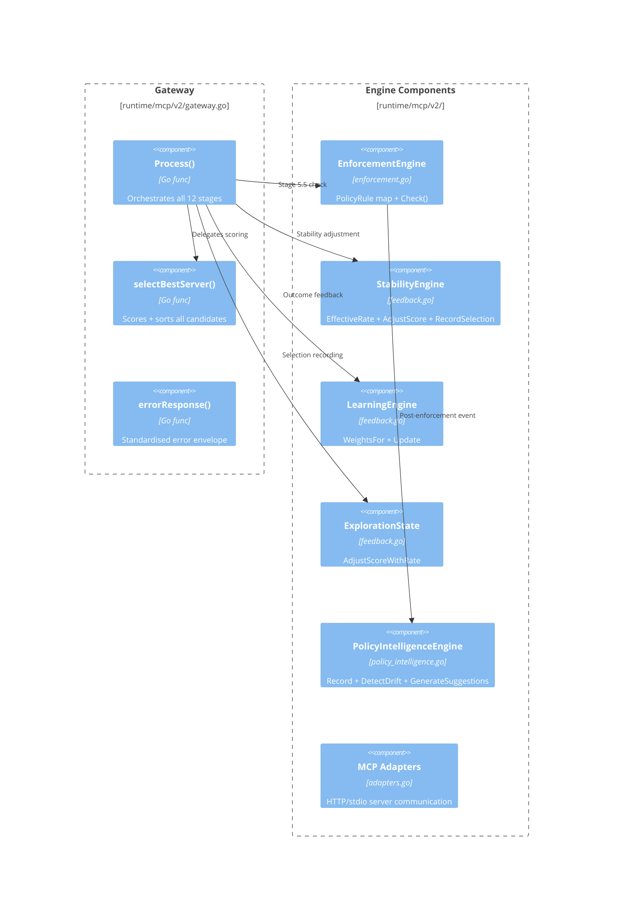
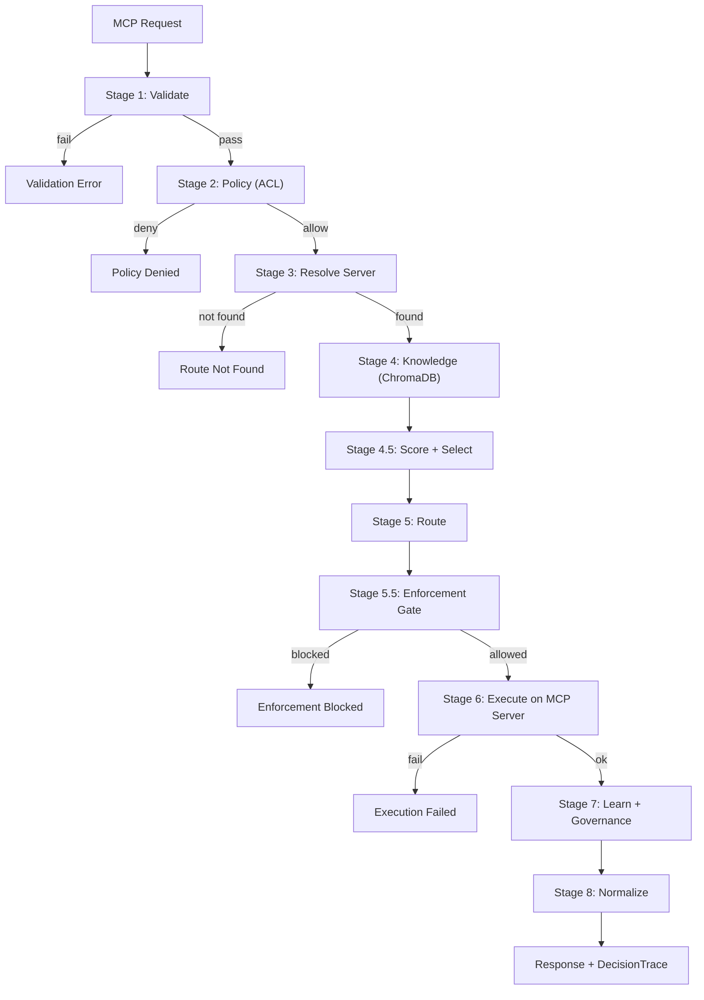
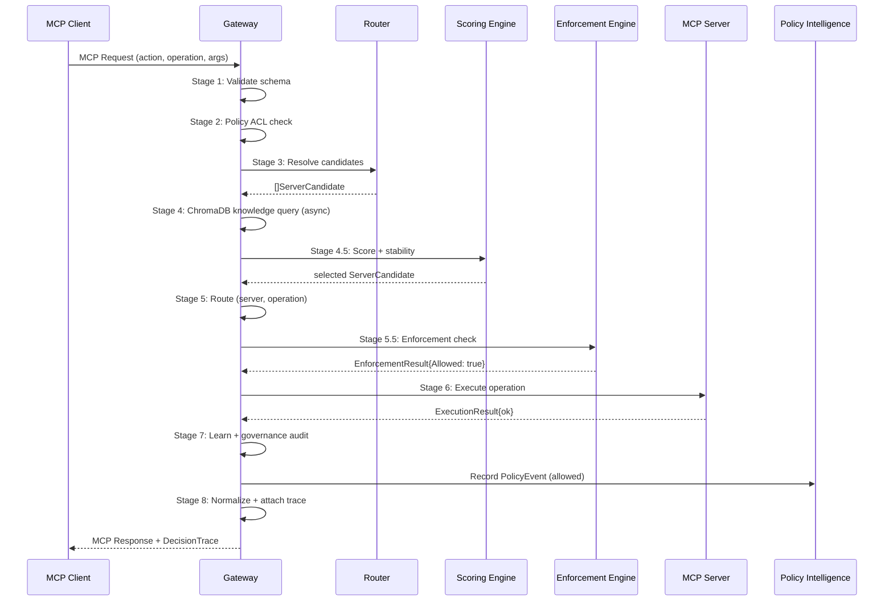
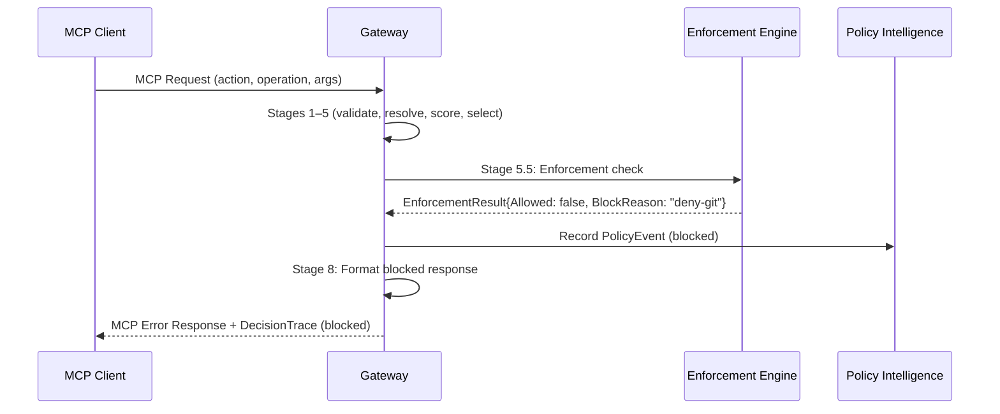
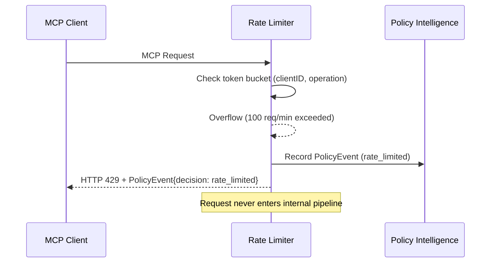
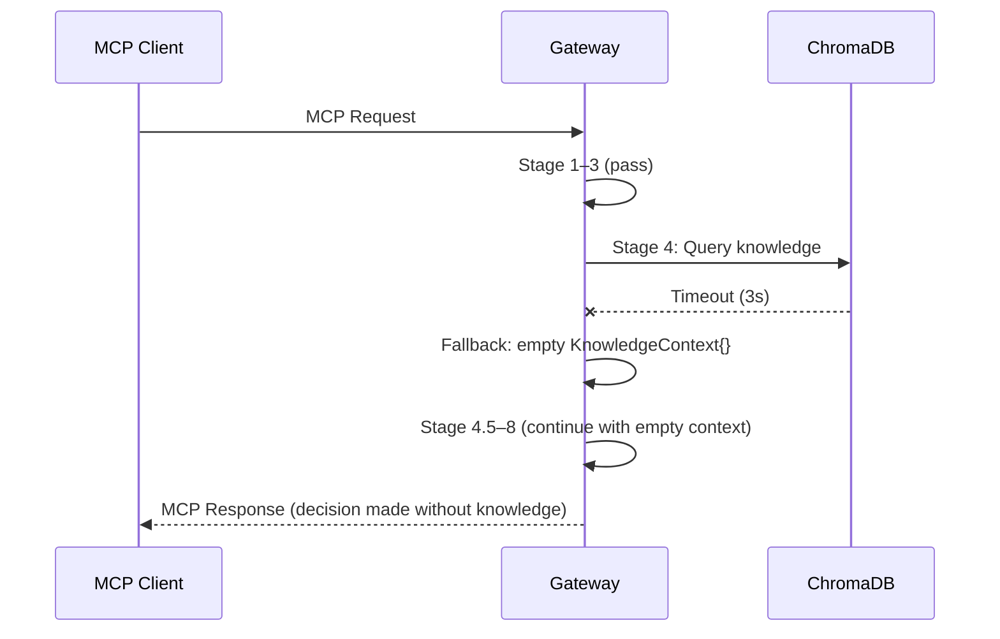

# MCP Runtime — Formal C4 Architecture Specification

**Version:** v3.1.1-stable
**Status:** Model-driven architecture specification (sidecar, read-only)
**Relationship:** Zero modification of runtime source files — documentation layer only
**Total:** ~1040 lines across 6 domains (Architecture, C4, Sequences, Contracts, Specs, Appendix)

---

## Index

| # | Section | Lines |
|---|---------|-------|
| 1 | Architecture Overview | 30 |
| 2 | C4 — Context Diagram | 60 |
| 3 | C4 — Container Diagram | 106 |
| 4 | C4 — Component Diagram | 152 |
| 5 | C4 — Execution Flow | 210 |
| 6 | Sequence Diagrams | 238 |
| 7 | Data Flow Contracts | 296 |
| 8 | Component Deep Specifications | 379 |
| 9 | System Boundaries | 488 |
| 10 | Cross-plane Interaction Rules | 522 |
| 11 | Architecture vs Runtime Separation | 550 |
| Appendix A | ADR-001: Enforcement Gate Isolation | 572 |
| Appendix B | ADR-002: Passive Policy Intelligence | 615 |
| Appendix C | ADR-003: Stability Engine Independence | 670 |
| Appendix D | Benchmark Specification | 720 |
| Appendix E | Threat Model | 800 |

---

# Section 1: Architecture Overview

## 1.1 Four-Plane Model

| Plane | Components | Authority | Data Flow Direction |
|-------|-----------|-----------|-------------------|
| **Execution** | Gateway, MCP Adapters, Router | Deterministic execution | Bidirectional (request → server → response) |
| **Intelligence** | Scoring, Stability, Learning, Exploration | Decision influence only | Read scores → apply adjustments |
| **Control** | Enforcement Engine | Allow/Block (sole authority) | Read enforcement rules → return decision |
| **Observability** | Decision Trace, Governance Audit, Policy Intelligence | Recording only | Append-only write |

## 1.2 Evolution Trace

```
v2.1–v2.7  → Knowledge + Governance + Exploration
v2.8       → Stability Engine (oscillation control)
v2.9       → Decision Trace (per-request explainability)
v3.0       → Enforcement Gate (control plane isolation)
v3.1       → Policy Intelligence (passive observability)
v3.1.1     → Hardening patch: PolicyEvent schema fix, rate-limiter design, invariant bindings, trace safety, identity doc, delta justification
HARDENING  → Freeze — no further architectural expansion
```

---

# Section 2: C4 — Context Diagram

## 2.1 System Boundary Map

```
┌──────────────────────────────────────────────────────────┐
│                    EXTERNAL WORLD                         │
│                                                           │
│  ┌──────────────┐     ┌──────────────────────────┐       │
│  │    MCP       │     │    MCP Tool Servers      │       │
│  │   Client     │     │  ┌────────────────────┐  │       │
│  │  (Public,    │     │  │ Git  │ FS  │ Memory│  │       │
│  │ Untrusted)   │     │  │ GitHub|Fetch│ Ctx7 │  │       │
│  └──────┬───────┘     │  │ Supa │ Chr │       │  │       │
│         │             │  └────────────────────┘  │       │
│         │ MCP/JSON-RPC│                          │       │
│         ▼             └────────────┬─────────────┘       │
│  ┌────────────────────────────────────────────────┐      │
│  │            MCP RUNTIME v3.1                    │      │
│  │  ┌──────────┐  ┌──────────┐  ┌────────────┐   │      │
│  │  │Execution │  │Intelligen│  │  Control   │   │      │
│  │  │  Plane   │  │  Plane   │  │   Plane    │   │      │
│  │  ├──────────┤  ├──────────┤  ├────────────┤   │      │
│  │  │Gateway   │  │Scoring   │  │Enforcement │   │      │
│  │  │Router    │  │Stability │  │ Gate       │   │      │
│  │  │Adapters  │  │Learning  │  │            │   │      │
│  │  └──────────┘  └──────────┘  └────────────┘   │      │
│  │  ┌────────────────────────────────────────┐    │      │
│  │  │        Observability Plane             │    │      │
│  │  │  DecisionTrace | PolicyIntelligence |  │    │      │
│  │  │           Governance Audit             │    │      │
│  │  └────────────────────────────────────────┘    │      │
│  └────────────────────┬───────────────────────────┘      │
│                       │                                  │
│                 ┌─────▼──────┐                          │
│                 │  ChromaDB  │                          │
│                 │   Cloud    │                          │
│                 │ (Knowledge)│                          │
│                 └────────────┘                          │
└──────────────────────────────────────────────────────────┘
```

## 2.2 C4 Context Diagram (Mermaid)



## 2.3 System Boundary Rules

- **Inside MCP Runtime**: All decision logic, enforcement, execution orchestration, observability, audit storage
- **Outside (controlled)**: MCP Tool Servers (pre-registered), ChromaDB (query-only)
- **Outside (untrusted)**: MCP Client (public, unauthenticated)
- **Boundary invariant**: No external system can influence enforcement logic directly

---

# Section 3: C4 — Container Diagram

## 3.1 Container Map (Mermaid)



## 3.2 Container Ownership Map

| Container | Plane | File | Lifecycle | State |
|-----------|-------|------|-----------|-------|
| Request Processor | Execution | `gateway.go` | Per-request | Stateless |
| Router | Execution | `gateway.go` | Per-request | Stateless |
| Scoring Engine | Intelligence | `feedback.go`, `schema.go` | Per-request + persistent | Weights map |
| Stability Engine | Intelligence | `feedback.go` | Persistent | Oscillation windows, convergence scores |
| Learning Engine | Intelligence | `feedback.go` | Per-request | Append-only |
| Enforcement Engine | Control | `enforcement.go` | Persistent | PolicyRule map |
| Policy Intelligence | Observability | `policy_intelligence.go` | Persistent | Event store, drift state |
| Decision Trace | Observability | `schema.go` | Per-request | Attached to response |
| Governance Audit | Observability | `governance.go` | Per-request | AuditRecord |

---

# Section 4: C4 — Component Diagram

## 4.1 Component Map (Mermaid)



## 4.2 Component Responsibilities

| Component | Input | Processing | Output | Error State |
|-----------|-------|-----------|--------|-------------|
| `Process()` | `MCPRequest` | Orchestrate stages 1–8 | `MCPResponse` | Error response per stage failure |
| `selectBestServer()` | `[]ServerCandidate` | Score × stability × exploration | selected `ServerCandidate` | Empty candidate → route error |
| `EnforcementEngine.Check()` | `(server, operation)` | Rule map lookup | `EnforcementResult` | Timeout/ambiguity → fail-close (Block) |
| `StabilityEngine.AdjustScore()` | `(server, score, operation)` | Oscillation penalty + stability bias | `adjustedScore float64` | Normal decay if no prior data |
| `LearningEngine.Update()` | `(server, operation, success)` | Weight increment/decrement | `void` | No-op on missing entry |
| `PolicyIntelligence.Record()` | `PolicyEvent` | Append to event window | `void` | Dropped at queue > 1000 |

---

# Section 5: C4 — Execution Flow

## 5.1 Pipeline Diagram

*Note: Stage 0 (Rate Limiter) sits before this pipeline as a pre-gateway edge layer. If the rate limit is exceeded, the request returns HTTP 429 and never enters Stage 1. The pipeline below represents the internal decision flow (Stages 1–8) only.*



## 5.2 Data Handoff Per Stage

| Stage | Input | Processing | Output | Owner Plane |
|-------|-------|-----------|--------|-------------|
| 1 | Raw request | Schema validation | `MCPRequest` | Execution |
| 2 | `MCPRequest` | ACL check | `policyResult` | Execution |
| 3 | `MCPRequest` | Server capability match | `[]ServerCandidate` | Execution |
| 4 | `MCPRequest` | ChromaDB query | `KnowledgeContext` | Execution |
| 4.5 | `[]ServerCandidate` | Score + stability + select | `selected Server` | Intelligence |
| 5 | `selected Server` | Route binding | `(server, operation)` | Execution |
| 5.5 | `(server, operation)` | Enforcement rule check | `EnforcementResult` | Control |
| 6 | `(server, operation, args)` | MCP call | `ExecutionResult` | Execution |
| 7 | `ExecutionResult` | Weight update + audit | `void` | Intel + Observability |
| 8 | `ExecutionResult` | Response format + trace | `MCPResponse` | Execution |

---

# Section 6: Sequence Diagrams

## 6.1 Normal Request — Happy Path



## 6.2 Enforcement Block Flow



## 6.3 Rate Limit Block Flow



## 6.4 Knowledge Timeout Fallback



---

# Section 7: Data Flow Contracts

## 7.1 DecisionContext — JSON Schema

```json
{
  "$schema": "https://json-schema.org/draft/2020-12/schema",
  "title": "DecisionContext",
  "description": "Immutable read-only state carrier flowing through all stages",
  "type": "object",
  "properties": {
    "traceID":    { "type": "string", "format": "uuid", "description": "Unique per request" },
    "actionType": { "type": "string", "enum": ["tool_call"], "description": "Always tool_call" },
    "operation":  { "type": "string", "description": "e.g. list_files, read_file, git_status" },
    "args":       { "type": "object", "description": "Operation-specific arguments" },
    "userID":     { "type": "string", "description": "Originating user identifier — sourced from JWT sub, API key hash, or request metadata; optional runtime metadata, not authentication enforcement" },
    "timestamp":  { "type": "string", "format": "date-time", "description": "Request arrival time" }
  },
  "required": ["traceID", "actionType", "operation", "timestamp"]
}
```

**Invariant**: Created once in Stage 1, immutable for the request lifetime. `userID` is optional runtime metadata — the system does not implement authentication; `userID` is passed through from the upstream client if available.

## 7.2 PolicyEvent — JSON Schema

```json
{
  "$schema": "https://json-schema.org/draft/2020-12/schema",
  "title": "PolicyEvent",
  "description": "Telemetry primitive emitted by Enforcement Gate (Stage 5.5) or Rate Limiter (Stage 0)",
  "type": "object",
  "properties": {
    "traceID":      { "type": "string", "description": "Links to DecisionContext" },
    "server":       { "type": "string", "description": "Selected MCP server name (empty for rate_limited)" },
    "operation":    { "type": "string", "description": "Operation attempted" },
    "decision":     { "type": "string", "enum": ["allowed", "blocked", "audit", "rate_limited"], "description": "Single deterministic outcome" },
    "ruleMatched":  { "type": "string", "description": "allow-all | deny-* | audit-* | rate-limit" },
    "reason":       { "type": "string", "description": "Populated when decision != allowed" },
    "timestamp":    { "type": "string", "format": "date-time" }
  },
  "required": ["traceID", "server", "operation", "decision", "timestamp"]
}
```

**Invariant**: `decision` is a single mutually exclusive enum value — exactly one of `allowed`, `blocked`, `audit`, or `rate_limited` per event. Append-only, write-once per enforcement or rate-limit check.

## 7.3 EnforcementResult — Formal Spec

```
EnforcementResult {
  Allowed:      bool     // true → proceed to execution; false → blocked
  RuleMatched:  string   // e.g. "allow-all", "deny-git-*", "audit-fetch-status"
  BlockReason:  string   // populated iff Allowed == false
}

Invariant:
  Allowed == false → pipeline terminates immediately (Stage 8 error response)
  No intelligence or execution layer may override this result
  Fail-close: timeout or ambiguity → Allowed = false, BlockReason = "enforcement-uncertain"
```

## 7.4 TraceStep — Formal Spec

```
TraceStep {
  Stage:      int           // 1 | 2 | 3 | 4 | 4.5 | 5 | 5.5 | 6 | 7 | 8
  Component:  string        // "Validate" | "EnforcementEngine" | "ScoringEngine" etc.
  Input:      string        // PII-safe summary of input
  Output:     string        // PII-safe summary of output
  Duration:   time.Duration // wall-clock execution time
  Error:      string        // empty if successful, otherwise error message
}

Invariant:
  All stages captured including errors and blocks
  Trace population is zero-overhead (never affects routing or execution decisions)
  Size capped at 128 steps; overflow truncates oldest

Size constraints:
  - Input / Output per TraceStep: ≤ 512 bytes each (soft limit, trunkated if exceeded)
  - Total DecisionTrace per request: ≤ 64 KB recommended cap (soft limit)
```

## 7.5 Data Flow Constraints

| Flow | Source → Target | Direction | Protocol | Safety |
|------|----------------|-----------|----------|--------|
| PolicyEvent (enforcement) | EnforcementEngine → PolicyIntelligenceEngine | Unidirectional, append-only | In-memory channel | Dropped at queue > 1000 |
| PolicyEvent (rate-limit) | RateLimiter → PolicyIntelligenceEngine | Unidirectional, append-only | In-memory channel | Dropped at queue > 1000 |
| EnforcementResult | EnforcementEngine → Gateway.Process() | Return value | Synchronous call | Authoritative, no override |
| DecisionTrace | Gateway.Process() → ResponseMeta | Attached copy | In-memory | Read-only after creation |
| KnowledgeContext | ChromaDB → Gateway → Scoring | Advisory | HTTP query → in-memory | Timeout → empty fallback |
| Weight updates | LearningEngine → persistent store | Deferred | In-memory append | No live influence on current request |

---

# Section 8: Component Deep Specifications

## 8.0 RateLimiter (Edge Layer — Pre-Gateway)

| Property | Value |
|----------|-------|
| **Plane** | Execution (edge) |
| **Role** | Pre-gateway request throttling — protects MCP servers from excessive traffic |
| **Position** | Stage 0 — before Stage 1 (Validate). Not part of the internal decision pipeline |
| **Algorithm** | Token Bucket per `(clientID, operation)` pair |
| **Soft limit** | 100 req/min per `clientID`, per operation |
| **Global limit** | 500 req/min aggregate across all clients |
| **Burst allowance** | 10 tokens initial burst per client |
| **On overflow** | Return HTTP 429 + emit `PolicyEvent{decision: "rate_limited", ruleMatched: "rate-limit"}` |
| **Flow impact** | Rate-limited requests never enter the internal pipeline (Stages 1–8). The rate limiter is an edge gate, not a pipeline stage |
| **Identifier** | `clientID` sourced from request metadata (see §7.1 identity handling) |
| **State** | In-memory token counters per `(clientID, operation)` with periodic reset |
| **Invariants** | Must never affect internal runtime flow; must never block requests under the limit; must never leak internal state to the client beyond the 429 response |

## 8.1 Gateway.Process()

| Property | Value |
|----------|-------|
| **File** | `runtime/mcp/v2/gateway.go` |
| **Plane** | Execution |
| **Role** | Request lifecycle orchestrator |
| **Input** | `MCPRequest` (raw JSON-RPC) |
| **Output** | `MCPResponse` (normalized envelope) |
| **Stages** | 1:Validate → 2:Policy → 3:Resolve → 4:Knowledge → 4.5:ScoreSelect → 5:Route → 5.5:Enforcement → 6:Execute → 7:Learn → 8:Normalize |
| **Invariants** | Always produces response (success or error); always populates DecisionTrace; never waits for intelligence if it times out |
| **Error handling** | Per-stage early return with structured error envelope |

## 8.2 EnforcementEngine.Check()

| Property | Value |
|----------|-------|
| **File** | `runtime/mcp/v2/enforcement.go` |
| **Plane** | Control |
| **Role** | Final authority gate before execution |
| **Input** | `(server string, operation string)` — the resolved pair |
| **Output** | `EnforcementResult` |
| **Rule matching** | Exact match on `(server, operation)`: deny-* > audit-* > allow-all |
| **Default** | Allow (backward compatible) |
| **Fail-close** | Timeout > 100ms or ambiguous → `Block` |
| **Invariants** | Only component that can block execution; result is never overridden; operates independently of scoring and stability |

## 8.3 StabilityEngine

| Property | Value |
|----------|-------|
| **File** | `runtime/mcp/v2/feedback.go` |
| **Plane** | Intelligence |
| **State** | Persistent: per-operation oscillation window (20 entries), per-server usage count, convergence scores |
| **Methods** | `AdjustScore(server, score, operation) → adjustedScore float64` |
| | `EffectiveRate(server) → float64` (exploration decay) |
| | `RecordSelection(server, operation)` (usage count increment) |
| **Algorithm** | `finalScore = baseScore + explorationAdjustment - oscillationPenalty + stabilityBias` |
| **Decay** | `EffectiveRate = baseRate × exp(-decayRate × usageCount)`, floor at 1% of base rate |
| **Oscillation** | Alternating pattern detection in sliding window; penalty proportional to oscillation frequency |
| **Invariants** | Never blocks execution; never modifies enforcement rules; operates in Intelligence Plane only |

## 8.4 ScoringEngine

| Property | Value |
|----------|-------|
| **File** | `runtime/mcp/v2/feedback.go`, `schema.go` |
| **Plane** | Intelligence |
| **Role** | Ranks candidate servers by capability match, knowledge relevance, and historical success |
| **Input** | `[]ServerCandidate`, `KnowledgeContext` |
| **Output** | Sorted `[]ServerCandidate` with scores |
| **Determinism** | Pure function: same input + same weights → same scores |
| **Invariants** | Scores are advisory only; enforcement is independent; no external data modifies weights mid-request |

## 8.5 LearningEngine

| Property | Value |
|----------|-------|
| **File** | `runtime/mcp/v2/feedback.go` |
| **Plane** | Intelligence |
| **Role** | Updates server weights based on execution outcomes |
| **Input** | `(server, operation, success bool)` |
| **Output** | `void` (side-effect: weight store update) |
| **Weight delta** | Success → +0.01, Failure → -0.02 |
| **Delta justification** | Asymmetric weighting (+0.01 success / -0.02 failure) is a deliberate conservative stability bias: failures penalized twice as heavily as successes rewarded. This prevents rapid weight inflation from a streak of lucky successes and ensures that a single failure meaningfully reduces a server's score. The asymmetry is capped by the stability engine's convergence bias, which can slowly restore a reliable server over time. This design prioritizes safety over rapid adaptation. |
| **Invariants** | Never modifies enforcement rules; never blocks execution; updates are deferred (no live effect on current request) |

## 8.6 PolicyIntelligenceEngine

| Property | Value |
|----------|-------|
| **File** | `runtime/mcp/v2/policy_intelligence.go` |
| **Plane** | Observability |
| **Role** | Passive observer of enforcement outcomes |
| **Input** | `PolicyEvent` (from EnforcementEngine) |
| **Output** | `void` (internal state only) |
| **Recording** | Append to event window per `(server, operation)` |
| **Weight update** | Allow → +0.01, Block → -0.02 |
| **Drift detection** | ≥3 blocks in last 10 events for same key |
| **Suggestion** | `{type: "review_policy", server, operation, confidence: [0.5, 0.95]}` |
| **Invariants** | Never feeds back into routing, scoring, or enforcement; suggestions are informational only; event store is internal (no external API) |

---

# Section 9: System Boundaries

## 9.1 Boundary Map

| Scope | Components | Can Modify Enforcement? | Can Block Execution? |
|-------|-----------|------------------------|---------------------|
| **Inside Runtime** | Gateway, Engines, Adapters, Audit, RateLimiter | No | Only EnforcementEngine |
| **Plugin/Adapter** | MCP Tool Servers | No | No (responses are opaque) |
| **External Storage** | ChromaDB | No | No (timeout → fallback) |
| **External Client** | MCP Client | No | No (requests are validated) |
| **Observability** | Audit log, Metrics | No | No |

## 9.2 Inside vs Outside

```
INSIDE MCP RUNTIME:
├── Request Processor       (gateway.go)
├── Router                  (gateway.go)
├── Scoring Engine          (feedback.go)
├── Stability Engine        (feedback.go)
├── Learning Engine         (feedback.go)
├── Enforcement Engine      (enforcement.go)       ← SOLE AUTHORITY
├── Policy Intelligence     (policy_intelligence.go)
├── Governance Audit        (governance.go)
└── Decision Trace          (schema.go)

OUTSIDE (registered controlled):
├── MCP Tool Servers
│   ├── Git Server          (port 4110, stdio)
│   ├── Filesystem Server   (port 4111, stdio)
│   ├── Memory Server       (port 4112, stdio)
│   ├── GitHub Server       (port 4115, HTTP)
│   ├── Fetch Server        (port 4116, stdio)
│   ├── Context7 Server     (port 4117, HTTP)
│   ├── Supabase Server     (port 4118, HTTP)
│   └── ChromaDB Server     (port 4114, HTTP)
├── ChromaDB Cloud          (SaaS, HTTP)

ALWAYS EXTERNAL (untrusted):
└── MCP Client              (public, no auth)
```

## 9.3 Boundary Invariants

- I1: No external component may write to Enforcement rule map
- I2: No external component may read PolicyEvent stream (internal only)
- I3: ChromaDB access is query-only (no write at runtime)
- I4: MCP Client receives DecisionTrace but cannot modify it
- I5: All inter-container communication is synchronous (call/return)

---

# Section 10: Cross-plane Interaction Rules

## 10.1 Authority Model

```
Execution Plane:
  → Can request scoring from Intelligence Plane
  → Can request enforcement check from Control Plane
  → Can write events to Observability Plane
  → CANNOT override enforcement decision

Intelligence Plane:
  → Can influence server selection (via scores + stability)
  → CANNOT block execution
  → CANNOT modify enforcement rules

Control Plane:
  → Can block execution (sole authority)
  → CANNOT influence scoring or routing

Observability Plane:
  → Can record everything
  → CANNOT influence anything
```

## 10.2 Invariant Binding Table

Each system invariant is explicitly bound to the components that enforce it:

| # | Invariant | Enforced By | Violation Consequence |
|---|-----------|-------------|----------------------|
| I1 | **Enforcement is sole control authority** — no other layer may block execution | `EnforcementEngine.Check()` | Block bypass → critical security failure |
| I2 | **Intelligence cannot influence enforcement** — scoring, stability, learning never modify enforcement rules | `StabilityEngine`, `ScoringEngine`, `LearningEngine` | Enforcement corruption → loss of control plane integrity |
| I3 | **Execution is always deterministic** — same input → same routing (modulo exploration) | `selectBestServer()`, `Process()` | Non-deterministic routing → unpredictable behavior |
| I4 | **System works without intelligence** — all intelligence layers are removable; execution + enforcement + audit survive | `Process()` (stage orchestration) | Intelligence crash → routing degrades to defaults, never blocks |
| I5 | **Traceability is always on** — every request produces a complete DecisionTrace | `Process()` (defer trace population), `TraceStep` | Missing trace → observability gap, non-fatal |
| I6 | **Policy Intelligence is passive** — no feedback loop into routing, scoring, or enforcement | `PolicyIntelligenceEngine` (design constraint) | Active feedback → enforcement drift, non-determinism |
| I7 | **Fail-close on uncertainty** — if enforcement cannot determine a decision, it blocks | `EnforcementEngine.Check()` (timeout/ambiguity handler) | Fail-open → unauthorized execution |
| I8 | **Rate Limiter is edge-only** — never affects internal pipeline; only returns 429 pre-gateway | `RateLimiter` (Stage 0 placement) | Internal blocking → violates I1 (Enforcement sole authority) |

---

# Section 11: Architecture vs Runtime Separation

## 11.1 Documentation Contract

| Layer | Files | Can Modify? | Purpose |
|-------|-------|-------------|---------|
| **Runtime System** | `runtime/` | NO | Live execution — frozen |
| **System Design Spec** | `SYSTEM_DESIGN.md` | NO | Contract-level specification — frozen |
| **Architecture Pack** | `architecture-pack/` | YES | Documentation layer — read-only knowledge |

## 11.2 Governance Rules

- NO file under `runtime/` is touched by the Architecture Pack
- NO behavioral specification in Architecture Pack overrides runtime implementation
- Architecture Pack is **read-only knowledge**, not executable configuration
- All Mermaid diagrams are documentation-only — they are not code-generated

## 11.3 Layer Separation

```
┌─────────────────────────────────────────────────────────┐
│              ARCHITECTURE PACK (static model)            │
│  ┌──────────┐  ┌─────┐  ┌─────────────┐  ┌──────────┐  │
│  │  C4 Spec │  │ ADR │  │ Benchmark   │  │  Threat  │  │
│  │(diagrams)│  │(why)│  │(SLA bounds) │  │ (OWASP)  │  │
│  └──────────┘  └─────┘  └─────────────┘  └──────────┘  │
│                         │                               │
│           describes     │     validates                 │
│                         ▼                               │
│              ┌─────────────────────┐                    │
│              │   RUNTIME SYSTEM   │                    │
│              │  (live execution)   │                    │
│              └─────────────────────┘                    │
└─────────────────────────────────────────────────────────┘
```

---

# Appendix A: ADR-001 — Enforcement Gate Isolation

**Status:** Accepted (v3.0) | **Scope:** Control Plane

## Context

Before v3.0, the system had a single `PolicyEngine` running at Stage 2 (pre-resolve). It checked ACLs by action type and operation but had no awareness of the **selected server**. Once adaptive routing (v2.5–v2.7) was added, scoring could select a server that should not be allowed for a specific operation, even if the action type was permitted.

Key observations:
- Policy ran before server selection — could not block on final `(server, operation)` pair
- Adaptive routing could override the default server, bypassing original policy intent
- No fail-safe: consensus among intelligence layers meant execution proceeded unchecked

## Decision

Introduce a dedicated **Enforcement Gate** as Stage 5.5, after routing selection, before execution:
- Sole authority to block execution
- Operates on the final `(server, operation)` pair
- Fully isolated from scoring, stability, and learning
- Defaults to allow-all (backward compatible)

## Consequences

**Positive:** Separation of decision from control; auditable independently; fail-safe for dangerous selections; zero behavioral change for existing deployments
**Negative:** Additional pipeline stage (sub-millisecond); requires explicit rule configuration
**Neutral:** Rules are static (v3.0 frozen); Policy Intelligence (v3.1) observes but does not modify them

## Principle

> Enforcement is the only control authority. No other layer may block execution.

---

# Appendix B: ADR-002 — Passive Policy Intelligence

**Status:** Accepted (v3.1) | **Scope:** Observability Plane

## Context

After Enforcement Gate (v3.0), there was no feedback on how enforcement was being used. Questions: which pairs are blocked most? Is enforcement drifting? Should rules be adjusted?

Two approaches: (1) active feedback loop — enforcement outcomes modify rules; (2) passive observation — record and analyse, never feed back.

Approach 1 rejected: creates destabilizing feedback loop; violates control/observation separation; makes enforcement non-deterministic.

## Decision

Implement **Policy Intelligence** as strictly passive:
- Records every `PolicyEvent` (TraceID, Server, Operation, decision: allowed|blocked|audit|rate_limited, Reason)
- Maintains per-server+operation weights (+0.01 allow, -0.02 block)
- Detects drift (≥3 blocks in last 10 events for same key)
- Generates non-binding suggestions (`review_policy` with confidence [0.5, 0.95])

All data structures are internal only — no API triggers enforcement changes.

## Consequences

**Positive:** Full enforcement history; drift early warning; safe suggestions
**Negative:** No automatic adjustment; in-memory only (no persistence in v3.1)
**Neutral:** Zero influence on routing, scoring, or enforcement

## Principle

> Policy Intelligence never influences decisions. It is a read-only observer of enforcement outcomes.

---

# Appendix C: ADR-003 — Stability Engine Independence

**Status:** Accepted (v2.8) | **Scope:** Intelligence Plane

## Context

By v2.7, adaptive routing could produce **oscillation** — rapid server switching when scores were similar (`git → fetch → git → fetch`). Effects: unpredictable latency, confusing audit logs, reduced user trust.

Two approaches: (1) add oscillation penalty to scoring function; (2) independent Stability Engine as post-exploration adjustment.

Approach 1 rejected: couples stability to scoring; makes scoring non-deterministic; complicates testing.

## Decision

Create an independent **Stability Engine**:
- Exploration decay: `baseRate × exp(-decayRate × usageCount)`, 1% floor
- Oscillation detection: alternating patterns in 20-entry sliding window per operation
- Convergence scoring: dominance ratio in window
- Stability bias: +0.01 per event when convergence > 0.5

Final score: `baseScore + explorationAdjustment - oscillationPenalty + stabilityBias`

## Consequences

**Positive:** Isolated stability concerns; pure scoring (deterministic); oscillation penalized without modifying routing; natural exploration decay
**Negative:** Additional processing step (sub-ms); bias can slow adaptation to genuinely better alternatives
**Neutral:** Influences selection, never enforcement; operates in Intelligence Plane

## Principle

> The Stability Engine influences decisions but never enforces them. It prevents oscillation without blocking execution.

---

# Appendix D: Benchmark Specification

## D1. Latency Budgets (per-request, p99)

| Stage | Budget | Notes |
|-------|--------|-------|
| Stage 0: Rate Limit | ≤ 20µs | Token bucket check (pre-gateway edge layer) |
| Stage 1: Validate | ≤ 50µs | Request parsing + schema check |
| Stage 2: Policy | ≤ 50µs | ACL lookup (Stage 2, pre-v3.0) |
| Stage 3: Resolve | ≤ 100µs | Server capability matching |
| Stage 4: Knowledge | ≤ 500ms | ChromaDB query (network-bound) |
| Stage 4.5: Score + Select | ≤ 200µs | Scoring + exploration + stability |
| Stage 5: Route | ≤ 50µs | Candidate-to-server binding |
| Stage 5.5: Enforcement | ≤ 50µs | Rule lookup + check |
| Stage 6: Execute | ≤ 5s | MCP server execution (external) |
| Stage 7: Learn + Governance | ≤ 100µs | Weight update + audit write |
| Stage 8: Normalize | ≤ 50µs | Response formatting + trace attach |

**Total system overhead (Stages 0–5 + 7–8, excluding execute):** ≤ 1ms p99

## D2. Decision Throughput SLA

| Metric | Target | Degradation | Critical |
|--------|--------|-------------|----------|
| Decisions/sec (single instance) | ≥ 500 | < 200 | < 50 |
| Concurrent requests | ≥ 50 | < 20 | < 5 |
| Decision latency p50 | ≤ 500µs | > 1ms | > 5ms |
| Decision latency p99 | ≤ 1ms | > 5ms | > 10ms |

## D3. Stress Thresholds

| Parameter | Value | Behaviour |
|-----------|-------|-----------|
| Max in-flight requests | 200 | Queue with backpressure |
| Max exploration rate | 50% (cap) | Capped regardless of configuration |
| Knowledge timeout | 3s | Fallback to empty `{}` context |
| Execution timeout | 30s | Stage 6 forced abort |
| Concurrent ChromaDB queries | 10 | Round-robin throttling |

## D4. Enforcement Under Load

- **Fail-close**: enforcement check > 100ms or ambiguous → Block
- **Policy Intelligence recording**: non-blocking, dropped at queue > 1000
- **DecisionTrace cap**: 128 steps; overflow truncates oldest

## D5. Convergence Metrics

| Metric | Target | Measurement |
|--------|--------|-------------|
| Oscillation frequency | < 5% of requests | Alternating pattern in convergence window |
| Stability bias accumulation | 0.01/request at convergence > 0.5 | `StabilityMetrics` |
| Exploration floor | 1% of base rate | `EffectiveRate()` |

## D6. Test Requirements

- **Functional**: 60 tests (v2–v3.1), all pass
- **Stress**: 1000 sequential valid requests, zero enforcement blocks
- **Stability**: 3 consecutive oscillation-free windows under randomized load
- **Enforcement**: every rule type (Allow, Deny, Audit) exercised

---

# Appendix E: Threat Model

## E1. Trust Boundaries

```
[MCP Client] ──── [MCP Gateway] ──── [MCP Tool Servers]
    (public)          (internal)          (trusted/untrusted)
```

| Boundary | Trust Level | Notes |
|----------|-------------|-------|
| Client → Gateway | Low | May be malformed, malicious, or unauthorised |
| Gateway → MCP Servers | Medium-High | Pre-registered; non-malicious but may have bugs |
| Gateway → ChromaDB | High | Query-only service account |

## E2. Threat Enumeration (OWASP TOP 10)

| ID | Threat | OWASP | Likelihood | Impact | Risk | Mitigation |
|----|--------|-------|-----------|--------|------|-----------|
| T1 | MCP Request Injection | A03:2021 | Low | High | Medium | Validate + Resolve + Enforcement |
| T2 | Enforcement Bypass | A01:2021 | Low | Critical | Medium | Network isolation + exact matching + fail-close |
| T3 | Scoring Manipulation | A08:2021 | Medium | Medium | Medium | Enforcement override + decay + empty fallback |
| T4 | DoS via Excessive Execution | A04:2021 | Low | Medium | Medium | Rate Limiter (Stage 0 — token bucket per clientID/operation) |
| T5 | Knowledge Base Poisoning | A08:2021 | Low | High | Medium | Query-only account + enforcement override |
| T6 | Policy Intelligence Data Leakage | A05:2021 | Low | Low | Low | Intentional transparency (by design) |
| T7 | Malicious MCP Server | A06:2021 | Medium | High | Medium | Opaque response handling + execution timeout |

## E3. Recommended Hardening (Post-Freeze)

1. **Rate limiting** — per-client, per-operation token bucket before Stage 1
2. **Policy rule versioning** — timestamps on `PolicyRule` for audit trail lineage
3. **DecisionTrace encryption** — optional HMAC signature to prevent client tampering
4. **Server health probes** — detect compromised or slow servers before routing
