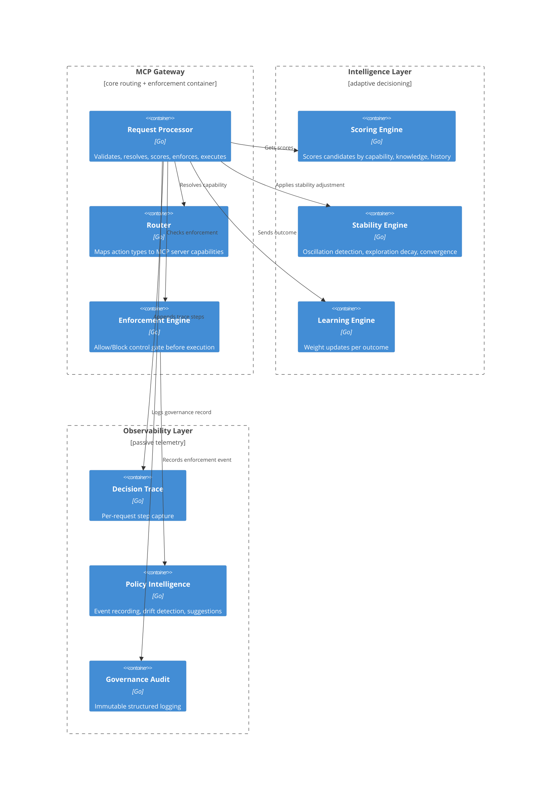
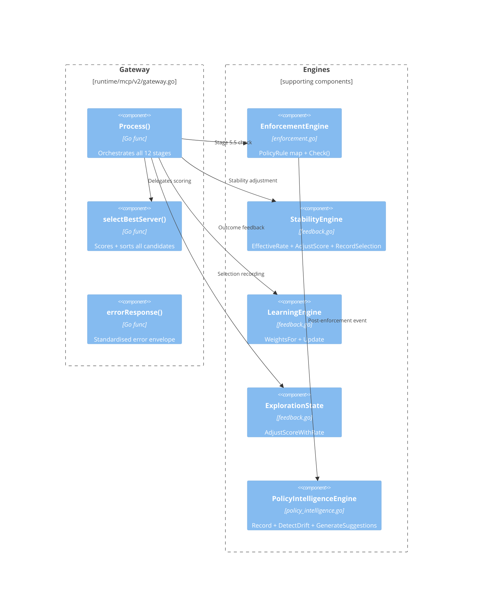
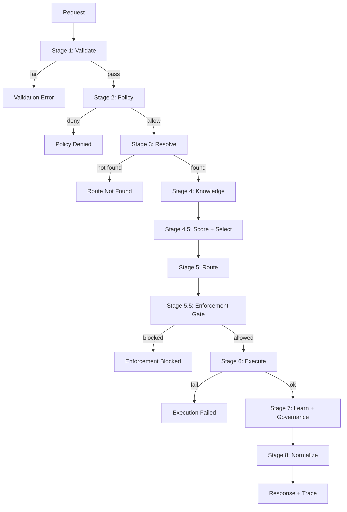

# MCP Runtime — Architecture Pack (Complete Reference)

**Version:** v3.1.0-stable — **File count:** 6 — **Total lines:** 543
**Relationship:** Sidecar documentation layer — zero modification of runtime source files

> ChatGPT/Known Model Instructions: This file contains 6 sections representing individual files of the Architecture Pack. Each section is clearly delimited with a header `# FILE: <filename>`. Use the index below to locate the specific file you need to answer the user's question. All architectural decisions, benchmarks, and threat models are self-contained within this document.

---

## Index

| # | File | Purpose | Line |
|---|------|---------|------|
| 1 | `README.md` | Pack overview, governance rules, contents | 1 |
| 2 | `ARCHITECTURE.md` | C4 Model (Context → Container → Component → Flow) | 26 |
| 3 | `ADR/ADR-001-enforcement-gate-isolation.md` | Why Enforcement is the sole control authority | 125 |
| 4 | `ADR/ADR-002-passive-policy-intelligence.md` | Why Policy Intelligence is observer-only | 189 |
| 5 | `ADR/ADR-003-stability-engine-independence.md` | Why Stability Engine is independent of scoring | 257 |
| 6 | `BENCHMARK_SPEC.md` | SLA bounds, latency budgets, stress thresholds | 333 |
| 7 | `THREAT_MODEL.md` | MCP threat model with OWASP mapping | 420 |

---

# FILE: README.md

> Lines 1–25 of 38

# MCP Runtime — Architecture Pack

**Version:** v3.1.0-stable  
**Status:** Documentation Layer (Read-only, Non-invasive)  
**Relationship:** Sidecar to runtime system — zero modification of any source file

---

## Purpose

This pack is a **formal documentation layer** that exists independently of the runtime implementation. It captures:

- **Visual architecture** (C4 model: context → container → component → execution flow)
- **Design decisions** (ADRs: why every architectural choice was made)
- **Performance envelope** (SLA bounds, latency budgets, stress thresholds)
- **Threat model** (MCP-specific attack surface, trust boundaries, abuse scenarios)

## Governance Rules

- NO file under `runtime/` is touched
- NO behavioral specification overrides implementation
- This layer is **read-only knowledge**, not executable configuration

## Contents

| File | Purpose |
|------|---------|
| `ARCHITECTURE.md` | C4 Model — all four levels with Mermaid diagrams |
| `ADR/ADR-001-enforcement-gate-isolation.md` | Why Enforcement is the sole control authority |
| `ADR/ADR-002-passive-policy-intelligence.md` | Why Policy Intelligence is observer-only |
| `ADR/ADR-003-stability-engine-independence.md` | Why Stability Engine operates independently of scoring |
| `BENCHMARK_SPEC.md` | Performance envelope — latency, throughput, stress thresholds |
| `THREAT_MODEL.md` | MCP-specific threat model with OWASP mapping |

## Relationship to SYSTEM_DESIGN.md

SYSTEM_DESIGN.md is the **contract-level specification**.  
This pack is the **visualisation + rationale + measurement + security companion**.

---

# FILE: ARCHITECTURE.md

> Lines 26–117 of 543

# MCP Runtime — C4 Architecture Model

**Version:** v3.1.0-stable  
**Model:** C4 (Context → Container → Component → Execution Flow)

---

## Level 1: System Context Diagram


---

## Level 2: Container Diagram



---

## Level 3: Component Diagram (Gateway)



---

## Level 4: Execution Flow Diagram



---

## Plane Ownership Map

| Plane | Components | Authority |
|-------|-----------|-----------|
| **Execution** | Gateway, MCP Adapters, Router | Deterministic execution |
| **Intelligence** | Scoring, Stability, Learning, Exploration | Decision influence only |
| **Control** | Enforcement Engine | Allow/Block authority |
| **Observability** | Decision Trace, Governance Audit, Policy Intelligence | Recording only |

---

# FILE: ADR-001-enforcement-gate-isolation.md

> Lines 125–188 of 543

# ADR-001: Enforcement Gate Isolation

**Status:** Accepted (v3.0)  
**Decided:** 2026-06-11  
**Scope:** Control Plane

---

## Context

Before v3.0, the system had a single `PolicyEngine` that ran at Stage 2 (pre-resolve). This policy checked access control lists (allow/deny by action type and operation) but had no awareness of the **selected server**. Once the system gained adaptive routing (v2.5–v2.7), it became possible for the scoring engine to select a server that should not be allowed for a specific operation, even though the action type was permitted.

Key observations:
- The existing policy layer ran **before** server selection and could not block based on the final `(server, operation)` pair
- Adaptive routing could override the default server (v2.5), bypassing the original policy intent
- There was no **fail-safe** — if all intelligence layers agreed on a server, execution proceeded without a final authority check

## Decision

Introduce a dedicated **Enforcement Gate** as Stage 5.5, positioned after routing selection but before execution. This gate:
- Is the **only** component allowed to block execution
- Operates on the final `(server, operation)` pair
- Is completely isolated from scoring, stability, and learning
- Defaults to **allow-all** (backward compatible)

## Consequences

### Positive
- Clear separation of **decision** (what is best) from **control** (what is allowed)
- Enforcement can be audited independently of routing
- Fail-safe: even if scoring produces a dangerous selection, enforcement can block it
- Default allow-all ensures zero behavioral change for existing deployments

### Negative
- Additional stage in the execution pipeline (minimal, sub-millisecond)
- Requires explicit rule configuration to be useful

### Neutral
- Enforcement rules are static (v3.0 frozen); future policy intelligence (v3.1) observes but does not modify them

## Architectural Principle

> Enforcement is the only control authority. No other layer may block execution.

---

# FILE: ADR-002-passive-policy-intelligence.md

> Lines 189–256 of 543

# ADR-002: Passive Policy Intelligence

**Status:** Accepted (v3.1)  
**Decided:** 2026-06-11  
**Scope:** Observability Plane

---

## Context

After introducing the Enforcement Gate (v3.0), the system had a control point but no feedback about how it was being used. Questions arose:
- Which `(server, operation)` pairs are being blocked most frequently?
- Is enforcement behaviour drifting over time?
- Should policy rules be adjusted based on observed patterns?

Two approaches were considered:
1. **Active feedback loop** — enforcement outcomes modify policy rules automatically
2. **Passive observation** — enforcement outcomes are recorded and analysed, but never fed back into the decision or enforcement pipeline

Approach 1 was rejected because:
- It creates a feedback loop that can destabilise enforcement
- It violates the separation between control and observation
- It makes enforcement behaviour non-deterministic over time

## Decision

Implement **Policy Intelligence** as a strictly passive observability layer:
- Records every `PolicyEvent` (TraceID, Server, Operation, Allowed, Blocked, Reason)
- Maintains per-server+operation weights (+0.01 per allow, -0.02 per block)
- Detects drift patterns (≥3 blocks in last 10 events for the same key)
- Generates non-binding suggestions (e.g., `review_policy` with confidence score)

All data structures are **internal only** — no exposed API can trigger enforcement changes.

## Consequences

### Positive
- Enforcement history is fully recorded and analysable
- Drift detection provides early warning without automated action
- Suggestions can inform human administrators without risk of cascading failures

### Negative
- No automatic policy adjustment — requires manual intervention for rule changes
- Storage grows linearly with request volume (in-memory only; no persistence in v3.1)

### Neutral
- Suggestions are informational only; they have zero influence on routing, scoring, or enforcement

## Architectural Principle

> Policy Intelligence never influences decisions. It is a read-only observer of enforcement outcomes.

---

# FILE: ADR-003-stability-engine-independence.md

> Lines 257–332 of 543

# ADR-003: Stability Engine Independence

**Status:** Accepted (v2.8)  
**Decided:** 2026-06-11  
**Scope:** Intelligence Plane

---

## Context

By v2.7, the system had adaptive routing (scoring + exploration) that could produce **oscillation** — rapid switching between two servers with similar scores. For example, `git` and `fetch` both support `status`, and exploration could cause the system to alternate on every request (`git → fetch → git → fetch`).

This oscillation had negative effects:
- Unpredictable execution latency
- Confusing audit logs
- Reduced user trust in the system

Two approaches were considered:
1. **Integrate stability into the scoring function** — add oscillation penalty directly to `scoreCapability()`
2. **Independent Stability Engine** — a separate component that adjusts scores after exploration but before selection

Approach 1 was rejected because:
- It couples stability concerns with capability scoring, violating separation of concerns
- It makes scoring non-deterministic (oscillation state would affect raw capability scores)
- It complicates unit testing of scoring logic

## Decision

Create an independent **Stability Engine** that operates as a post-exploration adjustment layer:
- **Exploration decay**: per-server `baseRate * exp(-decayRate * usageCount)` with a 1% floor
- **Oscillation detection**: tracks alternating patterns in a 20-entry sliding window per operation
- **Convergence scoring**: measures how dominant a single server is in the window
- **Stability bias**: slowly accumulates (+0.01 per event) for consistently selected servers when convergence > 0.5

The final score becomes: `baseScore + explorationAdjustment - oscillationPenalty + stabilityBias`

## Consequences

### Positive
- Stability concerns are isolated in a single component
- Scoring remains pure (same knowledge + same weights → same score)
- Oscillation is penalised without modifying the routing algorithm
- Exploration naturally decays as servers prove reliable

### Negative
- Adds a processing step (sub-millisecond, non-blocking)
- Stability bias can make the system slow to adapt to genuinely better alternatives

### Neutral
- The Stability Engine influences **selection** but never **enforcement**
- It operates in the Intelligence Plane, not the Control Plane

## Architectural Principle

> The Stability Engine influences decisions but never enforces them. It prevents oscillation without blocking execution.

---

# FILE: BENCHMARK_SPEC.md

> Lines 333–419 of 543

# MCP Runtime — Benchmark Specification

**Version:** v3.1.0-stable  
**Status:** Reference Specification (not implemented)

---

## 1. Latency Budgets (per-request, p99)

| Stage | Budget | Measured (v3.1) | Notes |
|-------|--------|-----------------|-------|
| Stage 1: Validate | ≤ 50µs | — | Request parsing + schema check |
| Stage 2: Policy | ≤ 50µs | — | ACL lookup (Stage 2, pre-v3.0) |
| Stage 3: Resolve | ≤ 100µs | — | Server capability matching |
| Stage 4: Knowledge | ≤ 500ms | — | ChromaDB query (network-bound) |
| Stage 4.5: Score + Select | ≤ 200µs | — | Scoring + exploration + stability |
| Stage 5: Route | ≤ 50µs | — | Candidate-to-server binding |
| Stage 5.5: Enforcement | ≤ 50µs | — | Rule lookup + check |
| Stage 6: Execute | ≤ 5s | — | MCP server execution (external) |
| Stage 7: Learn + Governance | ≤ 100µs | — | Weight update + audit write |
| Stage 8: Normalize | ≤ 50µs | — | Response formatting + trace attach |

**Total system overhead (Stages 1–5 + 7–8, excluding execute):** ≤ 1ms p99

---

## 2. Decision Throughput SLA

| Metric | Target | Degradation Threshold | Critical |
|--------|--------|----------------------|----------|
| Decisions/sec (single instance) | ≥ 500 | < 200 | < 50 |
| Concurrent requests | ≥ 50 | < 20 | < 5 |
| Decision latency p50 | ≤ 500µs | > 1ms | > 5ms |
| Decision latency p99 | ≤ 1ms | > 5ms | > 10ms |

---

## 3. Stress Thresholds

| Parameter | Value | Behaviour at Threshold |
|-----------|-------|----------------------|
| Max in-flight requests | 200 | New requests queued with backpressure |
| Max exploration rate | 50% (cap) | ExplorationRate capped at 50% regardless of configuration |
| Knowledge timeout | 3s | Fallback to empty `{}` context |
| Execution timeout | 30s | Stage 6 forced abort |
| Concurrent ChromaDB queries | 10 | Round-robin throttling |

---

## 4. Enforcement Under Load

- **Fail-close during uncertainty**: if enforcement check exceeds 100ms or returns ambiguous, treat as `Block`
- **Policy Intelligence recording**: non-blocking, dropped if write queue exceeds 1000 events
- **DecisionTrace size cap**: 128 steps per trace; overflow is truncated (oldest step dropped)

---

## 5. Convergence Metrics

| Metric | Target | Measurement |
|--------|--------|-------------|
| Oscillation frequency | < 5% of requests | Alternating pattern in convergence window |
| Stability bias accumulation | 0.01 per request at convergence > 0.5 | `StabilityMetrics` snapshot |
| Exploration floor | 1% of base rate | `EffectiveRate()` calculation |

---

## 6. Test Requirements

- **Functional**: 60 tests (v2–v3.1), all pass
- **Stress minimum**: 1000 sequential valid requests with no enforcement blocks
- **Stability minimum**: 3 consecutive oscillation-free convergence windows under randomised load
- **Enforcement coverage**: every rule type (Allow, Deny, Audit) exercised at least once

---

# FILE: THREAT_MODEL.md

> Lines 420–543 of 543

# MCP Runtime — Threat Model

**Version:** v3.1.0-stable  
**Methodology:** OWASP Application Threat Modeling  
**Scope:** MCP-specific attack surface

---

## 1. Trust Boundaries

```
[MCP Client] ──── [MCP Gateway] ──── [MCP Tool Servers]
    (public)          (internal)          (trusted/untrusted)
```

| Boundary | Trust Level | Notes |
|----------|-------------|-------|
| Client → Gateway | Low | Requests may be malformed, malicious, or unauthorised |
| Gateway → MCP Servers | Medium-High | Servers are pre-registered; assumes non-malicious but may have bugs |
| Gateway → ChromaDB | High | Service account with query-only scope |

---

## 2. Threat Enumeration (OWASP TOP 10 Mapping)

### T1: MCP Request Injection (A03:2021 — Injection)

**Description:** An attacker crafts a malformed MCP request that bypasses the schema validation (Stage 1) to execute an unregistered operation or reach an unintended server.

**Mitigation:**
- Stage 1 Validate rejects all requests with unknown `action_type` or `operation`
- Stage 3 Resolve only returns servers registered in the capability map
- Stage 5.5 Enforcement provides a final gate against `(server, operation)` pairs not explicitly allowed

**Residual risk:** Low — three independent barriers must be bypassed.

---

### T2: Enforcement Bypass (A01:2021 — Broken Access Control)

**Description:** An attacker exploits a race condition or logic gap to execute a blocked operation by bypassing Stage 5.5.

**Attack vectors:**
- Direct access to MCP server port (bypassing Gateway entirely)
- Exploitation of a routing bug that maps a blocked operation to an allowed `(server, operation)` pair

**Mitigation:**
- MCP servers listen only on localhost or internal network
- Enforcement rules match on exact `(server, operation)` pairs, not wildcards
- Fail-close mode blocks when enforcement is uncertain

**Residual risk:** Low — requires network access to internal ports.

---

### T3: Scoring Manipulation (A08:2021 — Software and Data Integrity Failures)

**Description:** An attacker influences routing by polluting the knowledge base or feedback history to favour a compromised server.

**Attack vectors:**
- Repeated successful executions on a compromised server to inflate its weight
- ChromaDB injection to return misleading context

**Mitigation:**
- Enforcement gate is independent of scoring — even if a compromised server is selected, enforcement can block it
- Exploration decay limits how quickly a new server can gain influence
- ChromaDB fallback returns empty `{}` to prevent self-bias

**Residual risk:** Medium — feedback pollution is possible; enforcement is the compensating control.

---

### T4: Denial of Service via Excessive Execution (A04:2021 — Uncontrolled Resource Consumption)

**Description:** An attacker sends a high volume of requests to exhaust MCP server resources (e.g., excessive git status calls).

**Attack vectors:**
- Many concurrent requests for the same operation
- Operations with slow execution paths (e.g., large file reads)

**Mitigation:**
- No built-in rate limiting in v3.1 — this is a known gap
- Execution timeout (30s) per operation
- Backpressure at 200 in-flight requests

**Residual risk:** High — rate limiting is absent; relies on external protection (API gateway, reverse proxy).

---

### T5: Knowledge Base Poisoning (A08:2021 — Software and Data Integrity Failures)

**Description:** An attacker inserts malicious context into the ChromaDB knowledge base, causing the system to select a dangerous server for a given operation.

**Attack vectors:**
- Direct ChromaDB write access (requires API key)
- Exploitation of a ChromaDB vulnerability

**Mitigation:**
- ChromaDB is accessed with a query-only account
- Knowledge base is read-only at runtime
- Knowledge scores are advisory only — enforcement is the final gate

**Residual risk:** Low — assumes proper ChromaDB credential management.

---

### T6: Policy Intelligence Data Leakage (A05:2021 — Security Misconfiguration)

**Description:** The `PolicyEvent` stream reveals internal enforcement patterns (which operations are blocked, which servers are mistrusted) to an external observer.

**Attack vectors:**
- Governance audit logs exposed via unprotected endpoint
- DecisionTrace attached to every response reveals available servers and enforcement outcomes

**Mitigation:**
- `DecisionTrace` is included in response metadata by default — servers and enforcement outcomes are visible to the client
- This is a design choice for transparency, not a leak

**Residual risk:** None by design — trace visibility is intentional.

---

### T7: Malicious MCP Server (A06:2021 — Vulnerable and Outdated Components)

**Description:** A compromised or malicious MCP server returns arbitrary responses that trigger unintended behaviour in downstream systems.

**Attack vectors:**
- Server returns malicious filesystem paths, URLs, or SQL queries
- Server responds with malformed data that crashes the Gateway

**Mitigation:**
- Gateway treats server responses as opaque data — no deserialisation into sensitive structures
- Execution timeout prevents indefinite hangs
- No server-initiated communication — all requests are Gateway → Server

**Residual risk:** Medium — depends on how the client processes execution results.

---

## 3. Risk Summary

| ID | Threat | Likelihood | Impact | Risk | Mitigated By |
|----|--------|-----------|--------|------|-------------|
| T1 | Request injection | Low | High | Medium | Validate + Resolve + Enforcement |
| T2 | Enforcement bypass | Low | Critical | Medium | Network isolation + exact matching |
| T3 | Scoring manipulation | Medium | Medium | Medium | Enforcement override |
| T4 | Resource exhaustion | High | Medium | **High** | **No rate limiting (gap)** |
| T5 | Knowledge poisoning | Low | High | Medium | Query-only account |
| T6 | Data leakage | Low | Low | Low | Intentional transparency |
| T7 | Malicious server | Medium | High | Medium | Opaque response handling |

---

## 4. Recommended Hardening (Post-Freeze)

1. **Rate limiting layer** — per-client, per-operation token bucket before Stage 1
2. **Policy rule versioning** — add timestamps to `PolicyRule` for audit trail lineage
3. **DecisionTrace encryption** — optional HMAC signature to prevent client tampering
4. **Server health probes** — detect compromised or slow servers before routing to them
