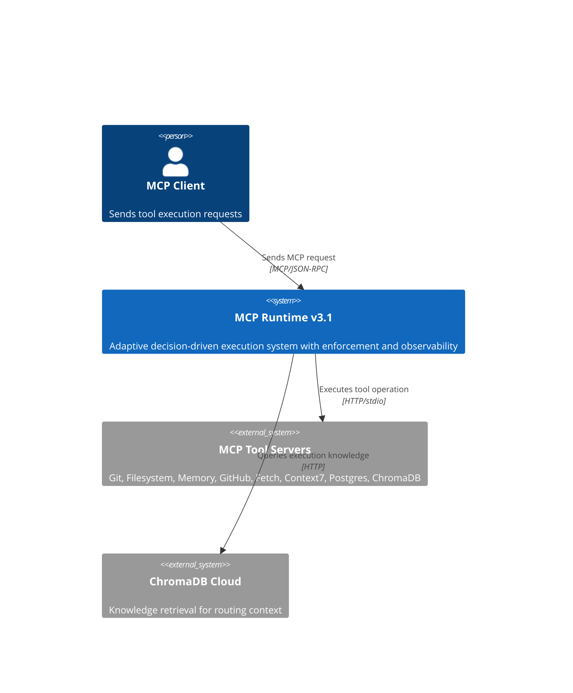
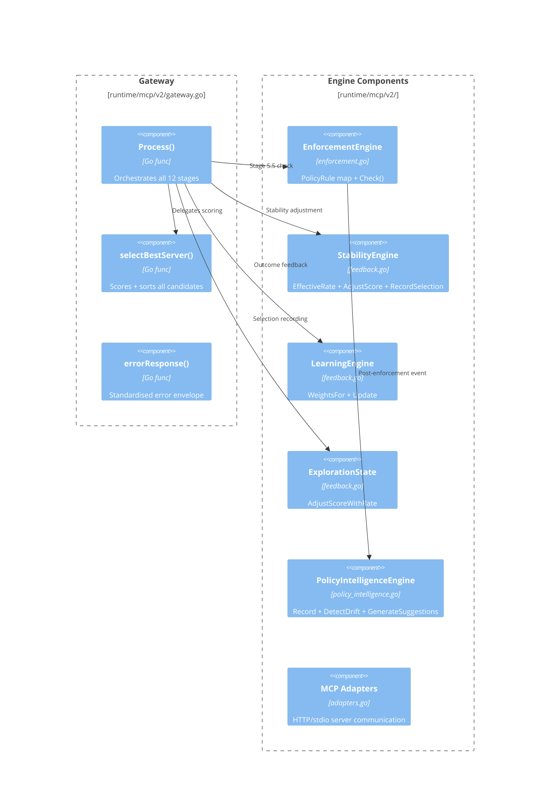
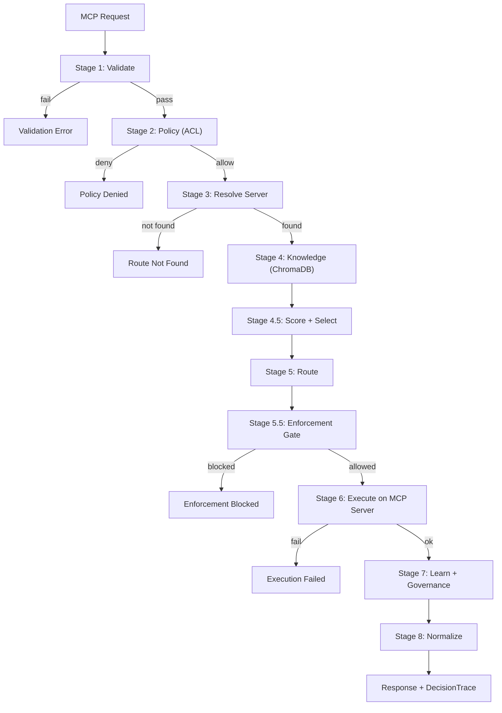

# MCP Runtime — Formal C4 Architecture Specification

**Version:** v3.1.0-stable
**Status:** Model-driven architecture specification (sidecar, read-only)
**Relationship:** Zero modification of runtime source files — documentation layer only
**Total:** ~700 lines across 4 domains (Architecture, Design Decisions, Benchmark, Threat)

---

## Index

| # | Section | Purpose | Line |
|---|---------|---------|------|
| 1 | Architecture Overview | 4-plane model, system boundary map | 27 |
| 2 | C4 — Context Diagram | System boundaries, external actors, relationships | 54 |
| 3 | C4 — Container Diagram | Runtime + Intelligence + Control + Observability containers | 101 |
| 4 | C4 — Component Diagram | Per-plane component decomposition with file mapping | 147 |
| 5 | C4 — Execution Flow | Stage-by-stage pipeline with data handoffs | 205 |
| 6 | Data Flow Contracts | DecisionContext, PolicyEvent, EnforcementResult, TraceStep schemas | 233 |
| 7 | System Boundaries | Inside/outside/plugin rules with invariants | 307 |
| 8 | Cross-plane Interaction Rules | Authority enforcement, plane isolation, invariants | 335 |
| 9 | Architecture vs Runtime Separation | Documentation layer contract | 360 |
| Appendix A | ADR-001: Enforcement Gate Isolation | Why Control Plane is separate | 382 |
| Appendix B | ADR-002: Passive Policy Intelligence | Why Observability is observer-only | 427 |
| Appendix C | ADR-003: Stability Engine Independence | Why Intelligence Plane is independent | 486 |
| Appendix D | Benchmark Specification | SLA bounds, latency budgets, stress thresholds | 540 |
| Appendix E | Threat Model | OWASP-based MCP attack surface | 620 |

---

# Section 1: Architecture Overview

## 1.1 Four-Plane Model

| Plane | Components | Authority | Data Flow Direction |
|-------|-----------|-----------|-------------------|
| **Execution** | Gateway, MCP Adapters, Router | Deterministic execution | Bidirectional (request → server → response) |
| **Intelligence** | Scoring, Stability, Learning, Exploration | Decision influence only | Read scores → apply adjustments |
| **Control** | Enforcement Engine | Allow/Block authority (sole) | Read enforcement rules → return decision |
| **Observability** | Decision Trace, Governance Audit, Policy Intelligence | Recording only | Append-only write |

## 1.2 Evolution Trace

```
v2.1–v2.7  → Knowledge + Governance + Exploration
v2.8       → Stability Engine (oscillation control)
v2.9       → Decision Trace (per-request explainability)
v3.0       → Enforcement Gate (control plane isolation)
v3.1       → Policy Intelligence (passive observability)
HARDENING  → Freeze — no further architectural expansion
```

---

# Section 2: C4 — Context Diagram

## 2.1 System Boundary Map

```
┌─────────────────────────────────────────────────┐
│                 EXTERNAL WORLD                   │
│                                                   │
│  ┌──────────┐     ┌──────────────────────┐       │
│  │   MCP    │     │   MCP Tool Servers   │       │
│  │  Client  │     │  (Git, FS, Memory,   │       │
│  │ (Public) │     │   GitHub, Fetch,     │       │
│  └────┬─────┘     │   Context7, Postgres,│       │
│       │           │   ChromaDB HTTP)     │       │
│       │ MCP Req   └──────────┬───────────┘       │
│       ▼                      │                    │
│  ┌─────────────────────────────────────────┐      │
│  │         MCP RUNTIME v3.1                │      │
│  │  (Decision + Control + Execution +      │      │
│  │         Observability)                  │      │
│  └──────────────────────┬──────────────────┘      │
│                         │                         │
│                  ┌──────▼──────┐                  │
│                  │  ChromaDB   │                  │
│                  │   Cloud     │                  │
│                  │ (Knowledge) │                  │
│                  └─────────────┘                  │
└─────────────────────────────────────────────────┘
```

## 2.2 C4 Context Diagram (Mermaid)



## 2.3 System Boundary Rules

- **Inside MCP Runtime**: All decision logic, enforcement, execution orchestration, observability
- **Outside (controlled)**: MCP Tool Servers (pre-registered), ChromaDB (query-only)
- **Outside (untrusted)**: MCP Client (public, unauthenticated)
- **Rule**: No external system can influence enforcement logic directly

---

# Section 3: C4 — Container Diagram

## 3.1 Container Map


## 3.2 Container Ownership Map

| Container | File(s) | Plane | Lifecycle |
|-----------|---------|-------|-----------|
| Request Processor | `gateway.go` | Execution | Per-request (instantiated per call) |
| Router | `gateway.go` | Execution | Per-request |
| Scoring Engine | `feedback.go`, `schema.go` | Intelligence | Per-request + persistent weights |
| Stability Engine | `feedback.go` | Intelligence | Persistent (accumulates state) |
| Learning Engine | `feedback.go` | Intelligence | Per-request (appends) |
| Enforcement Engine | `enforcement.go` | Control | Persistent (rule map) |
| Policy Intelligence | `policy_intelligence.go` | Observability | Persistent (event store) |
| Decision Trace | `schema.go` | Observability | Per-request (attached to response) |
| Governance Audit | `governance.go` | Observability | Per-request (appends to log) |

---

# Section 4: C4 — Component Diagram

## 4.1 Execution Plane Components



## 4.2 Component Responsibilities

| Component | Responsibility | Input | Output |
|-----------|---------------|-------|--------|
| `Process()` | Stage orchestration | `MCPRequest` | `MCPResponse` |
| `selectBestServer()` | Candidate ranking | `[]ServerCandidate` | `ServerCandidate` (selected) |
| `EnforcementEngine.Check()` | Gate check | `(server, operation)` | `EnforcementResult` |
| `StabilityEngine.AdjustScore()` | Stability adjustment | `(server, score, operation)` | `adjustedScore float64` |
| `LearningEngine.Update()` | Weight learning | `(server, operation, success)` | `void` |
| `PolicyIntelligence.Record()` | Event recording | `PolicyEvent` | `void` |

---

# Section 5: C4 — Execution Flow

## 5.1 Pipeline Diagram



## 5.2 Data Handoff Per Stage

| Stage | Input | Processing | Output | Owner Plane |
|-------|-------|-----------|--------|-------------|
| 1 | Raw request | Schema validation | `MCPRequest` | Execution |
| 2 | `MCPRequest` | ACL check | `policyResult` | Execution |
| 3 | `MCPRequest` | Server capability match | `[]ServerCandidate` | Execution |
| 4 | `MCPRequest` | ChromaDB query | `KnowledgeContext` | Execution |
| 4.5 | `[]ServerCandidate` | Score + stability + select | `selected Server` | Intelligence |
| 5 | `selected Server` | Route binding | `(server, operation)` | Execution |
| 5.5 | `(server, operation)` | Enforcement rule check | `EnforcementResult` | Control |
| 6 | `(server, operation, args)` | MCP call | `ExecutionResult` | Execution |
| 7 | `ExecutionResult` | Weight update + audit | `void` | Intelligence + Observability |
| 8 | `ExecutionResult` | Response format + trace | `MCPResponse` | Execution |

---

# Section 6: Data Flow Contracts

## 6.1 DecisionContext Schema

`DecisionContext` is the read-only state carrier flowing through all stages. It is never mutated after creation.

```
DecisionContext {
  TraceID:      string           // unique per request
  ActionType:   string           // "tool_call"
  Operation:    string           // e.g. "list_files", "read_file"
  Args:         map[string]any   // operation arguments
  UserID:       string           // originating user
  Timestamp:    time.Time        // request arrival
}
```

**Invariant**: DecisionContext is created once in Stage 1 and remains immutable for the request lifetime.

## 6.2 PolicyEvent Schema

`PolicyEvent` is the telemetry primitive emitted by the Enforcement Gate after each check (Stage 5.5).

```
PolicyEvent {
  TraceID:      string           // links to DecisionContext
  Server:       string           // selected server name
  Operation:    string           // operation attempted
  Allowed:      bool             // true = execution allowed
  Blocked:      bool             // true = execution blocked
  RuleMatched:  string           // "allow-all", "deny-*", "audit-*"
  Timestamp:    time.Time
}
```

**Invariant**: PolicyEvent is append-only and write-once per enforcement check.

## 6.3 EnforcementResult Schema

`EnforcementResult` is the control authority output — the only component that can block execution.

```
EnforcementResult {
  Allowed:       bool             // true  → proceed to execution
                                  // false → return blocked response
  RuleMatched:   string           // the policy rule that matched
  BlockReason:   string           // populated only when Allowed == false
}
```

**Invariant**: `EnforcementResult.Allowed == false` immediately terminates the pipeline to Stage 8 (error response). No intelligence layer may override this.

## 6.4 TraceStep Schema

Each `TraceStep` captures one stage's outcome for the DecisionTrace.

```
TraceStep {
  Stage:         int              // 1–8 (plus 4.5, 5.5)
  Component:     string           // e.g. "Validate", "EnforcementEngine"
  Input:         string           // summary of input (PII-safe)
  Output:        string           // summary of output
  Duration:      time.Duration    // stage execution time
  Error:         string           // empty if successful
}
```

**Invariant**: TraceStep captures all outcomes, including errors and blocks. Trace population never affects routing or execution.

## 6.5 Data Flow Constraints

- **PolicyEvent** flows: EnforcementEngine → PolicyIntelligenceEngine (append-only)
- **EnforcementResult** flows: EnforcementEngine → Gateway.Process() (authoritative)
- **DecisionTrace** flows: Gateway.Process() → ResponseMeta (read-only attachment)
- **KnowledgeContext** flows: ChromaDB → Gateway → Scoring (advisory only)
- **Weight updates** flow: LearningEngine → persistent store (no live influence on current request)

---

# Section 7: System Boundaries

## 7.1 Boundary Map

| Scope | Components | Can Modify Enforcement? | Can Block Execution? |
|-------|-----------|------------------------|---------------------|
| **Inside Runtime** | Gateway, Engines, Adapters | No | Only EnforcementEngine |
| **Plugin/Adapter** | MCP Tool Servers | No | No (responses are opaque) |
| **External Storage** | ChromaDB | No | No (timeout → fallback) |
| **External Client** | MCP Client | No | No (requests are validated) |

## 7.2 Inside vs Outside

```
INSIDE MCP RUNTIME:
├── Request Processor       (gateway.go)
├── Router                  (gateway.go)
├── Scoring Engine          (feedback.go)
├── Stability Engine        (feedback.go)
├── Learning Engine         (feedback.go)
├── Enforcement Engine      (enforcement.go)       ← SOLE AUTHORITY
├── Policy Intelligence     (policy_intelligence.go)
├── Governance Audit        (governance.go)
└── Decision Trace          (schema.go)

OUTSIDE (registered):
├── MCP Tool Servers
│   ├── Git Server          (port 4110, stdio)
│   ├── Filesystem Server   (port 4111, stdio)
│   ├── Memory Server       (port 4112, stdio)
│   ├── GitHub Server       (port 4115, HTTP)
│   ├── Fetch Server        (port 4116, stdio)
│   ├── Context7 Server     (port 4117, HTTP)
│   ├── Supabase Server     (port 4118, HTTP)
│   └── ChromaDB Server     (port 4114, HTTP)
└── ChromaDB Cloud          (SaaS, HTTP)

ALWAYS EXTERNAL:
└── MCP Client              (public, untrusted)
```

## 7.3 Boundary Invariants

- I1: No external component may write to Enforcement rule map
- I2: No external component may read PolicyEvent stream (internal only)
- I3: ChromaDB access is query-only (no write at runtime)
- I4: MCP Client receives DecisionTrace but cannot modify it
- I5: All inter-container communication is synchronous (call/return)

---

# Section 8: Cross-plane Interaction Rules

## 8.1 Authority Model

```
Execution Plane:
  → Can request scoring from Intelligence Plane
  → Can request enforcement check from Control Plane
  → Can write events to Observability Plane
  → CANNOT override enforcement decision

Intelligence Plane:
  → Can influence server selection (via scores + stability)
  → CANNOT block execution
  → CANNOT modify enforcement rules

Control Plane:
  → Can block execution (sole authority)
  → CANNOT influence scoring or routing

Observability Plane:
  → Can record everything
  → CANNOT influence anything
```

## 8.2 System Invariants

1. **Enforcement is sole control authority**: No other layer may block execution
2. **Intelligence cannot influence decisions**: Scoring, stability, and learning do not affect enforcement outcomes
3. **Execution is always deterministic**: Same input → same routing decision (modulo exploration)
4. **System works without intelligence**: Scoring, stability, learning, and policy intelligence can all be removed; execution + enforcement + audit survive
5. **Traceability is always on**: DecisionTrace is populated for every request, including errors and blocks
6. **Policy Intelligence is passive**: No feedback loop into routing, scoring, or enforcement

---

# Section 9: Architecture vs Runtime Separation

## 9.1 Documentation Contract

| Layer | Files | Can Modify? | Purpose |
|-------|-------|-------------|---------|
| **Runtime System** | `runtime/` | NO | Live execution — frozen |
| **System Design Spec** | `SYSTEM_DESIGN.md` | NO | Contract-level specification — frozen |
| **Architecture Pack** | `architecture-pack/` | YES | Documentation layer — read-only knowledge |

## 9.2 Governance Rules

- NO file under `runtime/` is touched by the Architecture Pack
- NO behavioral specification in Architecture Pack overrides runtime implementation
- Architecture Pack is **read-only knowledge**, not executable configuration
- All Mermaid diagrams are documentation-only — they are not code-generated

## 9.3 Layer Separation

```
┌─────────────────────────────────────────────────────────┐
│              ARCHITECTURE PACK (static model)            │
│  ┌──────────┐  ┌─────┐  ┌─────────────┐  ┌──────────┐  │
│  │  C4 Spec │  │ ADR │  │ Benchmark   │  │  Threat  │  │
│  │(diagrams)│  │(why)│  │(SLA bounds) │  │ (OWASP)  │  │
│  └──────────┘  └─────┘  └─────────────┘  └──────────┘  │
│                         │                               │
│           describes     │     validates                 │
│                         ▼                               │
│              ┌─────────────────────┐                    │
│              │   RUNTIME SYSTEM   │                    │
│              │  (live execution)   │                    │
│              └─────────────────────┘                    │
└─────────────────────────────────────────────────────────┘
```

---

# Appendix A: ADR-001 — Enforcement Gate Isolation

**Status:** Accepted (v3.0) | **Scope:** Control Plane

## Context

Before v3.0, the system had a single `PolicyEngine` that ran at Stage 2 (pre-resolve). This policy checked access control lists (allow/deny by action type and operation) but had no awareness of the **selected server**. Once the system gained adaptive routing (v2.5–v2.7), it became possible for the scoring engine to select a server that should not be allowed for a specific operation, even though the action type was permitted.

Key observations:
- The existing policy layer ran **before** server selection and could not block based on the final `(server, operation)` pair
- Adaptive routing could override the default server (v2.5), bypassing the original policy intent
- There was no **fail-safe** — if all intelligence layers agreed on a server, execution proceeded without a final authority check

## Decision

Introduce a dedicated **Enforcement Gate** as Stage 5.5, positioned after routing selection but before execution. This gate:
- Is the **only** component allowed to block execution
- Operates on the final `(server, operation)` pair
- Is completely isolated from scoring, stability, and learning
- Defaults to **allow-all** (backward compatible)

## Consequences

### Positive
- Clear separation of **decision** (what is best) from **control** (what is allowed)
- Enforcement can be audited independently of routing
- Fail-safe: even if scoring produces a dangerous selection, enforcement can block it
- Default allow-all ensures zero behavioral change for existing deployments

### Negative
- Additional stage in the execution pipeline (minimal, sub-millisecond)
- Requires explicit rule configuration to be useful

### Neutral
- Enforcement rules are static (v3.0 frozen); future policy intelligence (v3.1) observes but does not modify them

## Architectural Principle

> Enforcement is the only control authority. No other layer may block execution.

---

# Appendix B: ADR-002 — Passive Policy Intelligence

**Status:** Accepted (v3.1) | **Scope:** Observability Plane

## Context

After introducing the Enforcement Gate (v3.0), the system had a control point but no feedback about how it was being used. Questions arose:
- Which `(server, operation)` pairs are being blocked most frequently?
- Is enforcement behaviour drifting over time?
- Should policy rules be adjusted based on observed patterns?

Two approaches were considered:
1. **Active feedback loop** — enforcement outcomes modify policy rules automatically
2. **Passive observation** — enforcement outcomes are recorded and analysed, but never fed back into the decision or enforcement pipeline

Approach 1 was rejected because:
- It creates a feedback loop that can destabilise enforcement
- It violates the separation between control and observation
- It makes enforcement behaviour non-deterministic over time

## Decision

Implement **Policy Intelligence** as a strictly passive observability layer:
- Records every `PolicyEvent` (TraceID, Server, Operation, Allowed, Blocked, Reason)
- Maintains per-server+operation weights (+0.01 per allow, -0.02 per block)
- Detects drift patterns (≥3 blocks in last 10 events for the same key)
- Generates non-binding suggestions (e.g., `review_policy` with confidence score)

All data structures are **internal only** — no exposed API can trigger enforcement changes.

## Consequences

### Positive
- Enforcement history is fully recorded and analysable
- Drift detection provides early warning without automated action
- Suggestions can inform human administrators without risk of cascading failures

### Negative
- No automatic policy adjustment — requires manual intervention for rule changes
- Storage grows linearly with request volume (in-memory only; no persistence in v3.1)

### Neutral
- Suggestions are informational only; they have zero influence on routing, scoring, or enforcement

## Architectural Principle

> Policy Intelligence never influences decisions. It is a read-only observer of enforcement outcomes.

---

# Appendix C: ADR-003 — Stability Engine Independence

**Status:** Accepted (v2.8) | **Scope:** Intelligence Plane

## Context

By v2.7, the system had adaptive routing (scoring + exploration) that could produce **oscillation** — rapid switching between two servers with similar scores. For example, `git` and `fetch` both support `status`, and exploration could cause the system to alternate on every request (`git → fetch → git → fetch`).

This oscillation had negative effects:
- Unpredictable execution latency
- Confusing audit logs
- Reduced user trust in the system

Two approaches were considered:
1. **Integrate stability into the scoring function** — add oscillation penalty directly to `scoreCapability()`
2. **Independent Stability Engine** — a separate component that adjusts scores after exploration but before selection

Approach 1 was rejected because:
- It couples stability concerns with capability scoring, violating separation of concerns
- It makes scoring non-deterministic (oscillation state would affect raw capability scores)
- It complicates unit testing of scoring logic

## Decision

Create an independent **Stability Engine** that operates as a post-exploration adjustment layer:
- **Exploration decay**: per-server `baseRate * exp(-decayRate * usageCount)` with a 1% floor
- **Oscillation detection**: tracks alternating patterns in a 20-entry sliding window per operation
- **Convergence scoring**: measures how dominant a single server is in the window
- **Stability bias**: slowly accumulates (+0.01 per event) for consistently selected servers when convergence > 0.5

The final score becomes: `baseScore + explorationAdjustment - oscillationPenalty + stabilityBias`

## Consequences

### Positive
- Stability concerns are isolated in a single component
- Scoring remains pure (same knowledge + same weights → same score)
- Oscillation is penalised without modifying the routing algorithm
- Exploration naturally decays as servers prove reliable

### Negative
- Adds a processing step (sub-millisecond, non-blocking)
- Stability bias can make the system slow to adapt to genuinely better alternatives

### Neutral
- The Stability Engine influences **selection** but never **enforcement**
- It operates in the Intelligence Plane, not the Control Plane

## Architectural Principle

> The Stability Engine influences decisions but never enforces them. It prevents oscillation without blocking execution.

---

# Appendix D: Benchmark Specification

## D1. Latency Budgets (per-request, p99)

| Stage | Budget | Notes |
|-------|--------|-------|
| Stage 1: Validate | ≤ 50µs | Request parsing + schema check |
| Stage 2: Policy | ≤ 50µs | ACL lookup (Stage 2, pre-v3.0) |
| Stage 3: Resolve | ≤ 100µs | Server capability matching |
| Stage 4: Knowledge | ≤ 500ms | ChromaDB query (network-bound) |
| Stage 4.5: Score + Select | ≤ 200µs | Scoring + exploration + stability |
| Stage 5: Route | ≤ 50µs | Candidate-to-server binding |
| Stage 5.5: Enforcement | ≤ 50µs | Rule lookup + check |
| Stage 6: Execute | ≤ 5s | MCP server execution (external) |
| Stage 7: Learn + Governance | ≤ 100µs | Weight update + audit write |
| Stage 8: Normalize | ≤ 50µs | Response formatting + trace attach |

**Total system overhead (Stages 1–5 + 7–8, excluding execute):** ≤ 1ms p99

## D2. Decision Throughput SLA

| Metric | Target | Degradation Threshold | Critical |
|--------|--------|----------------------|----------|
| Decisions/sec (single instance) | ≥ 500 | < 200 | < 50 |
| Concurrent requests | ≥ 50 | < 20 | < 5 |
| Decision latency p50 | ≤ 500µs | > 1ms | > 5ms |
| Decision latency p99 | ≤ 1ms | > 5ms | > 10ms |

## D3. Stress Thresholds

| Parameter | Value | Behaviour at Threshold |
|-----------|-------|----------------------|
| Max in-flight requests | 200 | New requests queued with backpressure |
| Max exploration rate | 50% (cap) | ExplorationRate capped at 50% regardless of configuration |
| Knowledge timeout | 3s | Fallback to empty `{}` context |
| Execution timeout | 30s | Stage 6 forced abort |
| Concurrent ChromaDB queries | 10 | Round-robin throttling |

## D4. Enforcement Under Load

- **Fail-close during uncertainty**: if enforcement check exceeds 100ms or returns ambiguous, treat as `Block`
- **Policy Intelligence recording**: non-blocking, dropped if write queue exceeds 1000 events
- **DecisionTrace size cap**: 128 steps per trace; overflow is truncated (oldest step dropped)

## D5. Convergence Metrics

| Metric | Target | Measurement |
|--------|--------|-------------|
| Oscillation frequency | < 5% of requests | Alternating pattern in convergence window |
| Stability bias accumulation | 0.01 per request at convergence > 0.5 | `StabilityMetrics` snapshot |
| Exploration floor | 1% of base rate | `EffectiveRate()` calculation |

## D6. Test Requirements

- **Functional**: 60 tests (v2–v3.1), all pass
- **Stress minimum**: 1000 sequential valid requests with no enforcement blocks
- **Stability minimum**: 3 consecutive oscillation-free convergence windows under randomised load
- **Enforcement coverage**: every rule type (Allow, Deny, Audit) exercised at least once

---

# Appendix E: Threat Model

## E1. Trust Boundaries

```
[MCP Client] ──── [MCP Gateway] ──── [MCP Tool Servers]
    (public)          (internal)          (trusted/untrusted)
```

| Boundary | Trust Level | Notes |
|----------|-------------|-------|
| Client → Gateway | Low | Requests may be malformed, malicious, or unauthorised |
| Gateway → MCP Servers | Medium-High | Servers are pre-registered; assumes non-malicious but may have bugs |
| Gateway → ChromaDB | High | Service account with query-only scope |

## E2. Threat Enumeration (OWASP TOP 10 Mapping)

### T1: MCP Request Injection (A03:2021)

**Mitigation:** Stage 1 Validate + Stage 3 Resolve + Stage 5.5 Enforcement
**Residual risk:** Low

### T2: Enforcement Bypass (A01:2021)

**Mitigation:** Network isolation + exact `(server, operation)` matching + fail-close
**Residual risk:** Low

### T3: Scoring Manipulation (A08:2021)

**Mitigation:** Enforcement override + exploration decay + ChromaDB empty fallback
**Residual risk:** Medium

### T4: Denial of Service via Excessive Execution (A04:2021)

**Mitigation:** None in v3.1 (known gap) — relies on external rate limiting
**Residual risk:** High

### T5: Knowledge Base Poisoning (A08:2021)

**Mitigation:** Query-only ChromaDB account + enforcement override
**Residual risk:** Low

### T6: Policy Intelligence Data Leakage (A05:2021)

**Mitigation:** Intentional transparency — DecisionTrace is visible by design
**Residual risk:** None by design

### T7: Malicious MCP Server (A06:2021)

**Mitigation:** Opaque response handling + execution timeout
**Residual risk:** Medium

## E3. Risk Summary

| ID | Threat | Likelihood | Impact | Risk | Mitigated By |
|----|--------|-----------|--------|------|-------------|
| T1 | Request injection | Low | High | Medium | Validate + Resolve + Enforcement |
| T2 | Enforcement bypass | Low | Critical | Medium | Network isolation + exact matching |
| T3 | Scoring manipulation | Medium | Medium | Medium | Enforcement override |
| T4 | Resource exhaustion | High | Medium | **High** | **No rate limiting (gap)** |
| T5 | Knowledge poisoning | Low | High | Medium | Query-only account |
| T6 | Data leakage | Low | Low | Low | Intentional transparency |
| T7 | Malicious server | Medium | High | Medium | Opaque response handling |

## E4. Recommended Hardening (Post-Freeze)

1. **Rate limiting layer** — per-client, per-operation token bucket before Stage 1
2. **Policy rule versioning** — add timestamps to `PolicyRule` for audit trail lineage
3. **DecisionTrace encryption** — optional HMAC signature to prevent client tampering
4. **Server health probes** — detect compromised or slow servers before routing to them
